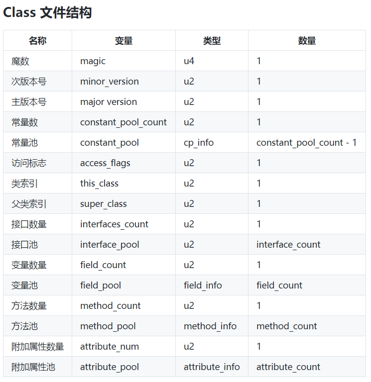
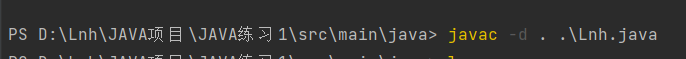
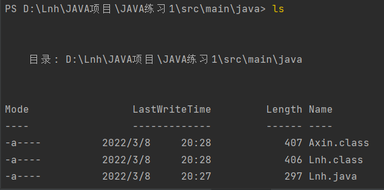

# Class文件的结构

JVM(java虚拟机) 的作用是加载 编译器编译好的字节码，然后将其解释成机器码。

由于Java纯面向对象的特性，字节码只要能表示一个类的信息，就可以表示整个Java 程序了。 JVM 只要能加载一个类的信息，就能加载整个程序了。

字节码不是一次性加载进内存，哪怕一个源文件有多个类，但只有一个 public 类，编译器都会给每一个类生成一个 .class 文件。JVM加载时按照需要加载的类的名称加载就好。



上面的表可以简单总结成下面几部分。

- 魔数与class版本
- 常量池
- 访问标志
- 类索引，z父类索引，接口索引
- 字段表
- 方法表
- 属性表

Demo：

```java
public class Lnh {
    private int age;

    public Lnh() {
    }

    public void sayHello() {
        System.out.println("hello");
    }
}

class Axin {
    private int age;

    public Axin() {
    }

    public void sayHello() {
        System.out.println("hello");
    }
}
```





java 给每个类都创建了 .class 文件。

### 魔数与class版本

1. magic：魔数，前1-4字节，`0xCAFEBABE` 相当于文件头，用于标识此文件是.class 文件。
2. minor_version，major_version ：各 u2 ，表示次主版本号。class文件版本向下兼容，即高版本 jdk 可以使用低版本的 .class 文件。反之不行。


**字节码的核心在于其16进制代码**，利用规范中的规则去解析这些代码，可以得出关于这个类的全部信息，包括：

1. 这个类的版本号；

2. 这个类的常量池大小，以及常量池中的常量；

3. 这个类的访问权限；

4. 这个类的全限定名、直接父类全限定名、类的直接实现的接口信息；

5. 这个类的类变量和实例变量的信息；

6. 这个类的方法信息；

7. 其它的这个类的附加信息，如来自哪个源文件等。
