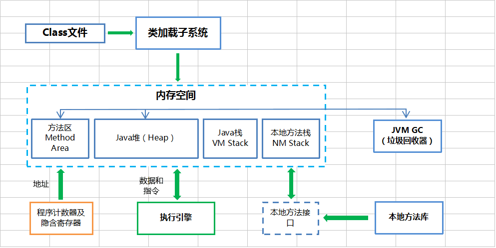

# Java JVM 运行机制及基本原理


## JVM的基础概念

JVM的中文名称叫Java虚拟机，它是由软件技术模拟出计算机运行的一个虚拟的计算机。

我们都知道Java的程序需要经过编译后，产生.Class文件，JVM才能识别并运行它，JVM针对每个操作系统开发其对应的解释器，所以只要其操作系统有对应版本的JVM，那么这份Java编译后的代码就能够运行起来，这就是Java能一次编译，到处运行的原因。


## JVM的生命周期

JVM在Java程序开始执行的时候，它才运行，程序结束的时它就停止。

一个Java程序会开启一个JVM进程，如果一台机器上运行三个程序，那么就会有三个运行中的JVM进程。

JVM中的线程分为两种：守护线程和普通线程

守护线程是JVM自己使用的线程，比如垃圾回收（GC）就是一个守护线程。

普通线程一般是Java程序的线程，只要JVM中有普通线程在执行，那么JVM就不会停止。

权限足够的话，可以调用exit()方法终止程序。


## JVM的结构体系




## JVM的启动过程

### JVM的装入环境和配置

JDK是面向开发人员使用的SDK，它提供了Java的开发环境和运行环境，JDK中包含了JRE。

JRE是Java的运行环境，是面向所有Java程序的使用者，包括开发者。

**JRE = 运行环境 = JVM**。

如果安装了JDK，会发现电脑中有两套JRE，一套位于/Java/jre.../下，一套位于/Java/jdk.../jre下。

java.exe 的任务就是找到合适的JRE来运行 java 程序。

java.exe 按照以下的顺序来选择JRE：

1、自己目录下有没有JRE

2、父目录下有没有JRE

3、查询注册表： HKEY_LOCAL_MACHINE\SOFTWARE\JavaSoft\Java Runtime Environment\"当前JRE版本号"\JavaHome

这几步的主要核心是为了找到JVM的绝对路径。

### 装载JVM

通过第一步找到JVM的路径后，Java.exe通过LoadJavaVM来装入JVM文件。

LoadLibrary装载JVM动态连接库，然后把JVM中的到处函数JNI_CreateJavaVM和JNI_GetDefaultJavaVMIntArgs 挂接到InvocationFunction 变量的CreateJavaVM和GetDafaultJavaVMInitArgs 函数指针变量上。

### 初始化JVM，获得本地调用接口

调用 InvocationFunction -> CreateJavaVM 也就是JVM中 JNI_CreateJavaVM 方法获得 JNIEnv 结构的实例。

### 运行Java程序

JVM运行Java程序的方式有两种：jar包 与 Class

**运行jar 的时候**，Java.exe调用GetMainClassName函数，该函数先获得JNIEnv实例然后调用JarFileJNIEnv类中getManifest()，从其返回的Manifest对象中取getAttrebutes("Main-Class")的值，即jar 包中文件：META-INF/MANIFEST.MF指定的Main-Class的主类名作为运行的主类。之后main函数会调用Java.c中LoadClass方法装载该主类（使用JNIEnv实例的FindClass）。

**运行Class的时候**，main函数直接调用Java.c中的LoadClass方法装载该类。


## 类加载子系统

类加载子系统也可以称之为类加载器，JVM默认提供三个类加载器：

**1、BootStrap ClassLoader** ：称之为启动类加载器，是最顶层的类加载器，**负责加载JDK中的核心类库，如 rt.jar、resources.jar、charsets.jar等**。

**2、Extension ClassLoader**：称之为扩展类加载器，负责加载Java的扩展类库，默认加载$JAVA_HOME中jre/lib/*.jar 或 -Djava.ext.dirs指定目录下的jar包。

**3、App ClassLoader**：称之为系统类加载器，负责加载应用程序classpath目录下所有jar和class文件。

除了Java默认提供的三个ClassLoader（加载器）之外，我们还可以根据自身需要自定义ClassLoader，自定义ClassLoader必须继承java.lang.ClassLoader 类。

**除了BootStrap ClassLoader 之外**的另外两个默认加载器都是继承自java.lang.ClassLoader 。

BootStrap ClassLoader 不是一个普通的Java类，它底层由C++编写，已嵌入到了JVM的内核当中，当JVM启动后，BootStrap ClassLoader 也随之启动，负责加载完核心类库后，并构造Extension ClassLoader 和App ClassLoader 类加载器。

类加载器子系统不仅仅负责定位并加载类文件，它还严格按照以下步骤做了很多事情：

```reStructuredText
1、加载：寻找并导入Class文件的二进制信息
2、连接：进行验证、准备和解析
     1）验证：确保导入类型的正确性
     2）准备：为类型分配内存并初始化为默认值
     3）解析：将字符引用解析为直接引用
3、初始化：调用Java代码，初始化类变量为指定初始值
```


## 方法区

在JVM中，**类型信息**和**类静态变量**都保存在方法区中，类型信息是由类加载器在类加载的过程中从类文件中提取出来的信息。

需要注意的一点是，**常量池也存放于方法区中**。

程序中所有的线程共享一个方法区，所以访问方法区的信息必须确保线程是安全的。如果有两个线程同时去加载一个类，那么只能有一个线程被允许去加载这个类，另一个必须等待。

在程序运行时，方法区的大小是可以改变的，程序在运行时可以扩展。

**类型信息包括什么？**

```text
1、类型的全名（The fully qualified name of the type）

2、类型的父类型全名（除非没有父类型，或者父类型是java.lang.Object）（The fully qualified name of the typeís direct superclass）

3、该类型是一个类还是接口（class or an interface）（Whether or not the type is a class ）

4、类型的修饰符（public，private，protected，static，final，volatile，transient等）（The typeís modifiers）

5、所有父接口全名的列表（An ordered list of the fully qualified names of any direct superinterfaces）

6、类型的字段信息（Field information）

7、类型的方法信息（Method information）

8、所有静态类变量（非常量）信息（All class (static) variables declared in the type, except constants）

9、一个指向类加载器的引用（A reference to class ClassLoader）

10、一个指向Class类的引用（A reference to class Class）

11、基本类型的常量池（The constant pool for the type）
```

**方法列表：**

为了更高效的访问所有保存在方法区中的数据，在方法区中，除了保存上边的这些类型信息之外，还有一个为了加快存取速度而设计的数据结构：方法列表。每一个被加载的非抽象类，Java虚拟机都会为他们产生一个方法列表，这个列表中保存了这个类可能调用的所有实例方法的引用，保存那些父类中调用的方法。


## Java堆

当Java**创建一个类的实例对象或者数组时，都在堆中为新的对象分配内存**。

虚拟机中只有一个堆，程序中所有的线程都共享它。

堆占用的内存空间是最多的。

堆的存取类型为管道类型，先进先出。

在程序运行中，可以动态的分配堆的内存大小。


## Java栈

在Java栈中**只保存基础数据类型**和自定义对象的**引用**，**注意只是对象的引用而不是对象本身哦**，对象是保存在堆区中的。

**像String、Integer、Byte、Short、Long、Character、Boolean这六个属于包装类型，它们是存放于堆中的。**

栈内的数据在超出其作用域后，会被自动释放掉，**它不由JVM GC管理**。

每一个线程都包含一个栈区，每个栈中的数据都是私有的，其他栈不能访问。

每个线程都会建立一个操作栈，每个栈又包含了若干个栈帧，每个栈帧对应着每个方法的每次调用，每个栈帧包含了三部分：

局部变量区（方法内基本类型变量、变量对象指针）

操作数栈区（存放方法执行过程中产生的中间结果）

运行环境区（动态连接、正确的方法返回相关信息、异常捕捉）


## JVM执行引擎

Java虚拟机相当于一台虚拟的“物理机”，这两种机器都有代码执行能力，其区别主要是物理机的执行引擎是直接建立在处理器、硬件、指令集和操作系统层面上的。而JVM的执行引擎是自己实现的，因此程序员可以自行制定指令集和执行引擎的结构体系，因此能够执行那些不被硬件直接支持的指令集格式。

在JVM规范中制定了虚拟机字节码执行引擎的概念模型，这个模型称之为JVM执行引擎的统一外观。JVM实现中，可能会有两种的执行方式：解释执行（通过解释器执行）和编译执行（通过即时编译器产生本地代码）。有些虚拟机只采用一种执行方式，有些则可能同时采用两种，甚至有可能包含几个不同级别的编译器执行引擎。

**输入的是字节码文件、处理过程是等效字节码解析过程、输出的是执行结果**。在这三点上每个JVM执行引擎都是一致的。


## JVM 常量池

JVM常量池也称之为运行时常量池，**它是方法区（Method Area）的一部分**。**用于存放编译期间生成的各种字面量和符号引用。运行时常量池不要求一定只有在编译器产生的才能进入，运行期间也可以将新的常量放入池中，这种特性被开发人员利用比较多的就是String.intern()方法。**

**八种基本类型的包装类和常量池**

Byte、Short、Integer、Long、Character、Boolean、String这7种包装类都各自实现了自己的常量池。

```java
//例子：
Integer i1 = 20;
Integer i2 = 20;
System.out.println(i1=i2);//输出TRUE
```

Byte、Short、Integer、Long、Character这5种包装类都默认创建了数值[-128 , 127]的缓存数据。**当对这5个类型的数据不在这个区间内的时候，将会去创建新的对象，并且不会将这些新的对象放入常量池中。**

```js
//例子
Integer i1 = 200;
Integer i2 = 200;
System.out.println(i1==i2);//返回FALSE
```

**Float 和Double 没有实现常量池**。


**String包装类与常量池**

```java
String str1 = "aaa";
```

当以上代码运行时，JVM会到字符串常量池查找 "aaa" 这个字面量对象是否存在？

**存在**：则返回该对象的引用给变量 **str1** 。

**不存在**：则在堆中创建一个相应的对象，将创建的对象的引用存放到常量池中，同时将引用返回给变量 **str1** 。

```java
String str1 = "aaa";
String str2 = "aaa";
System.out.println(str1 == str2);//返回TRUE
```

因为变量**str1** 和**str2** 都指向同一个对象，所以返回true。

```java
String str3 = new String("aaa");
System.out.println(str1 == str3);//返回FALSE
```

当我们使用了**new**来构造字符串对象的时候，不管字符串常量池中是否有相同内容的对象的引用，新的字符串对象都会创建。因为两个指向的是不同的对象，所以返回FALSE 。
