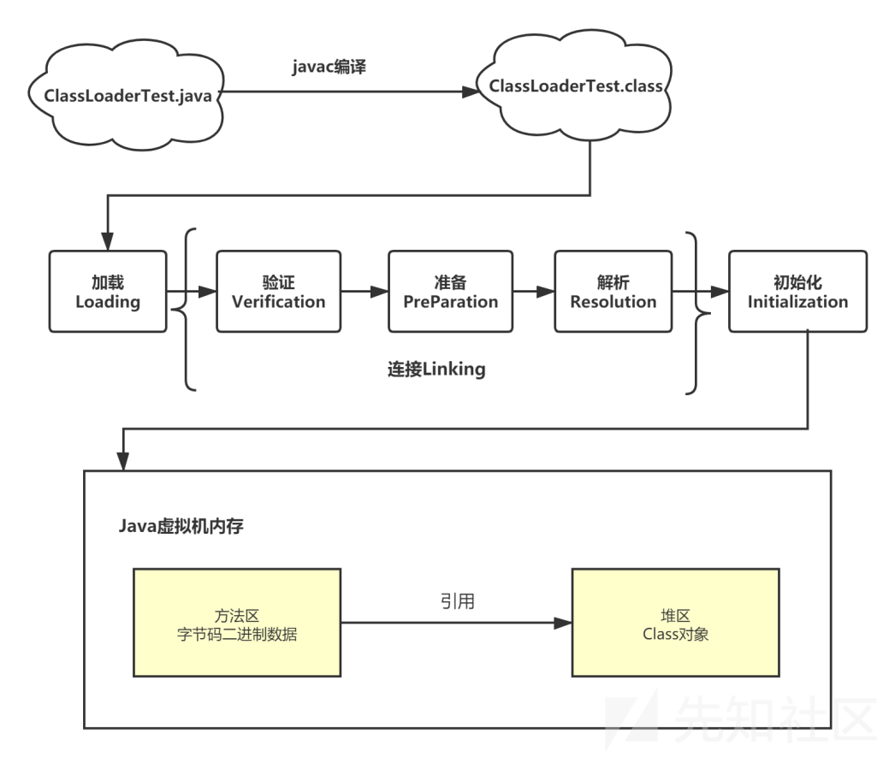
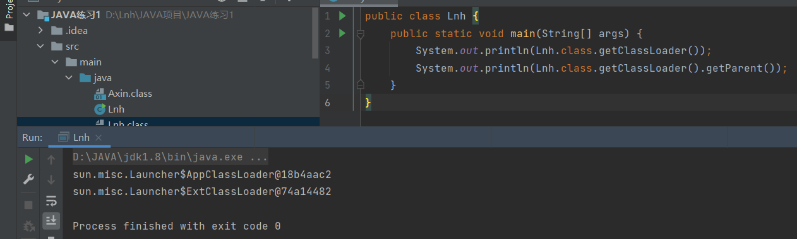
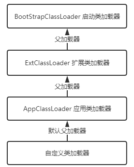
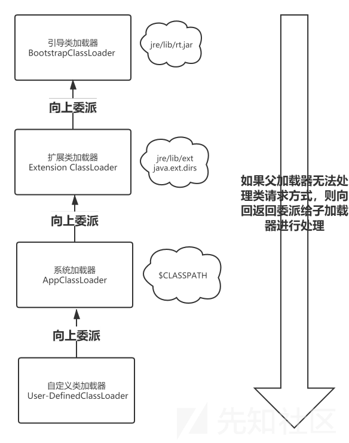

# 类加载机制

一个 class 文件想要执行，必须要加载到 jvm 中，这里学习一下一个 class 文件如何变成一个 java 类

类加载生命周期：



## 类加载的时机

类型的加载过程必须按照 加载、验证、准备、初始化和卸载 这五个阶段的顺序，但是解析阶段不一定：它在某些情况下可以在初始化阶段之后再开始， 这是为了支持Java语言的运行时绑定特性（也称为动态绑定或晚期绑定）。

在六种情况下，类必须进行初始化（自然，在初始化之前，加载、验证、准备阶段也都会执行）：

- 遇到 new、getstatic、putstatic 或 invokestatic 这四条字节码指令时，如果类型没有进行过初始化，则需要先触发其初始化阶段
- 使用 java.lang.reflect 包的方法对类型进行反射调用的时候，如果类型没有进行过初始化，则需要先触发其初始化。
- 当初始化类的时候，如果发现其父类还没有进行过初始化，则需要先触发其父类的初始化
- 当虚拟机启动时，用户需要指定一个要执行的主类（包含 main() 方法的那个类），虚拟机会先初始化这个主类。
- 当使用 JDK 7 新加入的动态语言支持时，如果一个 java.lang.invoke.MethodHandle 实例最后的解 析结果为 REF_getStatic、REF_putStatic、REF_invokeStatic、REF_newInvokeSpecial 四种类型的方法句 柄，并且这个方法句柄对应的类没有进行过初始化，则需要先触发其初始化。
- 当一个接口中定义了 JDK 8 新加入的默认方法（被 default 关键字修饰的接口方法）时，如果有 这个接口的实现类发生了初始化，那该接口要在其之前被初始化

上面六种情况都是因为要使用到具体的类，使用之前肯定得先有这个类，所以必须得先执行类的初始化。

## 类加载过程

### 加载

加载过程 jvm 做了三件事：

- 通过一个类的全限定名来获取定义此类的二进制字节流。
- 将这个字节流所代表的静态存储结构转化为方法区的运行时数据结构。
- 在内存中生成一个代表这个类的 java.lang.Class 对象，作为方法区这个类的各种数据的访问入口。

class 文件可以从下面几种地方获取：

- 从ZIP压缩包中读取，这很常见，最终成为日后JAR、EAR、WAR格式的基础。
- 从网络中获取，这种场景最典型的应用就是 Web Applet，java 开发者所熟知的 URLClassloader 就可以加载远程的 class 文件。
- 运行时计算生成，这种场景使用得最多的就是动态代理技术，在 java.lang.reflect.Proxy 中，就是用 了ProxyGenerator.generateProxyClass() 来为特定接口生成形式为 "*$Proxy" 的代理类的二进制字节流。
- 由其他文件生成，典型场景是JSP应用，由JSP文件生成对应的Class文件。
- 从数据库中读取，这种场景相对少见些，例如有些中间件服务器（如SAP Netweaver）可以选择 把程序安装到数据库中来完成程序代码在集群间的分发。
- 可以从加密文件中获取，这是典型的防Class文件被反编译的保护措施，通过加载时解密 Class 文件来保障程序运行逻辑不被窥探。

连接阶段的部分行为会与加载阶段交叉进行，例如：在加载尚未结束时，就可以对加载成功的部分二进制流进行文件格式验证

### 验证

验证阶段是为了验证 class 的字节流中的数据是否符合《Java虚拟机规范》的要求，虽然 java 通过 javac 编译过后的class文件可以确保是符合规范的，，但是 class 文件毕竟是一个普通文件，是可以被修改的，验证阶段就是为了避免不规范的 class 被 jvm 使用，从而危害jvm 安全

主要工作是文件格式验证，元数据验证，字节码验证，以及符号引用验证。

只有经过文件格式验证，字节流才会进入内存的方法区进行存储，而后面的三个验证阶段都是基于方法区的存储结构进行。

元数据验证：保证类信息符合Java语言规范。

字节码验证：为了确定语义合法，符合逻辑，最为复杂。

符号引用验证：发生在虚拟机将符号引用转化成直接引用的阶段（解析阶段），是进行对类信息以外的信息（常量池中的各种符号引用）进行匹配性校验

### 准备

准备阶段是正式为类变量（静态变量）分配内存（方法区分配）并赋初始值的阶段，但是这里的初始值是（null或0或false）而不是代码中所赋的值

例如如下代码：

```
public static int value = 123;
```

在准备阶段后，类变量 value 的值是0而不是123，因为在准备阶段还没有任何 java 方法被执行，而给类变量赋值的操作是需要调用类构造器`<clinit>()`方法中的 putstatic 指令的

### 解析

将常量池中的符号引用转化成直接引用。符号是指 class 文件中的各种常量。符号引用仅仅使用相应的符号来表示要引用的目标，并不要求所引用的目标都在内存当中。直接引用则不同，直接引用和内存布局相关，直接引用的对象一定是被加载到内存当中的。

### 初始化

执行类构造器方法`<clinit>()`对类变量以及类中各种静态代码块中的变量进行赋值操作

### 卸载

当类对应的 Class对象不在被引用时，类会被卸载，类在方法区的数据也会被删除。

Class 对象始终会被其类加载器引用，也就是说，如果类是被启动类加载器（引导类加载器）、以及应用类加载器加载的，那他始终不会被卸载。

## 类加载器

加载过程是通过类加载器实现的

- 对于任意一个类，都必须由加载它的类加载器和这个类本身一起共同确立其在Java虚拟机中的唯一性，每一个类加载器，都拥有一个独立的类名称空间

站在 java 虚拟机的角度来看，只存在两种类加载器：一种是启动类加载器（Bootstrap ClassLoader)，它采用c++实现，是虚拟机的一部分，还有一种就是其他所有的类加载器，采用 java 语言实现，独立于虚拟机外部，并且全都继承自`java.lang.ClassLoader`

而站在程序员的角度，类加载器应该更细化一点，java 一直保持着三层类加载器、双亲委派的类加载架构

- 启动类加载器，负责加载`<JAVA_HOME>\lib`目录下的或者被-Xbootclasspath参数所指定的路径中存放的类库到虚拟机内存中

  不继承 `java.lang.ClassLoader` 类，也没有父加载器。出于安全考虑，`BootstrapClassLoader` 只加载包名为 java、javax、sun等开头的类。

- 扩展类加载器（Extension Class Loader），它负责加载 \lib\ext 目录中，或者被 java.ext.dirs 系统变量所 指定的路径中所有的类库

- 应用程序类加载器（Application Class Loader），它负责加载用户类路径 （ClassPath）上所有的类库


自定义类加载器：

通过继承 java.lang.ClassLoader 类 并重写 findClass() 方法的方式实现自定义类加载器。

应用场景：

1. 资源隔离

   实现不同项目或者同一项目不同版本的jar包隔离，避免集群错误，或者冲突的产生。

2. 破坏双亲委派，实现热部署等功能

   对于Java应用程序来说，热部署就是运行时更新 java 类文件。类装入器不能重新装入一个已经装入的类，但只需要使用一个新的类装入器实例，就可以将类再次装入一个正在运行的应用。这样我们应用正在运行的时候升级软件，却不需要重启应用。

3. 代码保护

   可以对字节码文件进行加密，然后再使用特定的 Classloader 解密文件内容，再加载这些字节码文件。这样就能够实现对我们的代码项目加密保护，别人无法进行反编译查看源代码信息；或者从非标准的来源如网络获取二进制字节码进行加载。


父加载器：

ClassLoader 里的 parent 是父加载器。父加载器不是父类，任何一个类加载器调用 getParent() 得到的对象就是他的父加载器。



比如应用类加载器的父加载器就是扩展类加载器，扩展类加载器的 parent 是 null，这说明其父加载器是启动类加载器，所有 parent 是null的父加载器都为 `BootstrapClassLoader`。  

如果一个自定义类加载器，且不指定父加载器，那么其父加载器是 AppClassLoader。




为了确保一些 java 基础类在 java 内存中的唯一性，jvm 的类加载器采用了双亲委派的架构

### 双亲委派架构



1. 当一个类加载器接收到类加载任务时，先检查缓存里有没有，如果没有，则由本加载器的父类加载器尝试加载，父加载器也做同样的事情。
2. 只有当父类加载器不能完成加载动作时，才由本类加载器进行加载。如果父类加载器为 null，则使用启动类加载器尝试加载。默认是应用类加载器，逐级向上委托。
3. 如果最底层类加载器仍然没有找到所需要的 class文件，抛出异常。

这样的好处：

Java类随着他的类加载器一起具备了一种带有优先级的层次关系。保证一些基本的 Java 不会被破坏，如Object、String 等。因为标志了一个类除了类本身，还有加载它的类加载器。**确保类的全局唯一性。**

#### 破坏双亲委托机制

一是基础类需要回调用户的代码，这时由于基础类是由更上层的类加载器加载的，他不能加载用户代码中的类，如果还按照双亲委托，则这些类永远无法加载。如JNDI、JDBC等都是这种场合。解决办法就是引入"线程上下文类加载器"，来加载用户代码中的类，这个线程上下文加载器不是双亲委派机制下的类加载器，自然不受双亲委托机制的约束。

二是在要求程序动态性的场合，需要代码热替换，模块热部署。这时类加载机制就不再是双亲委派机制中的树状结构，而是复杂的网状结构。
